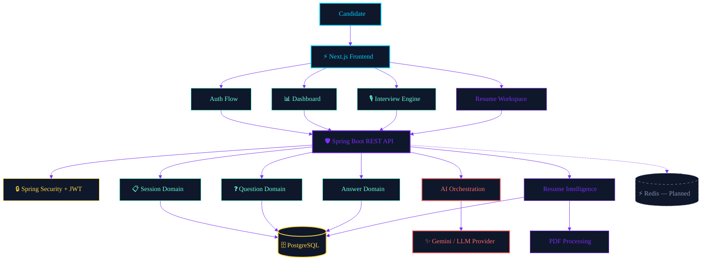
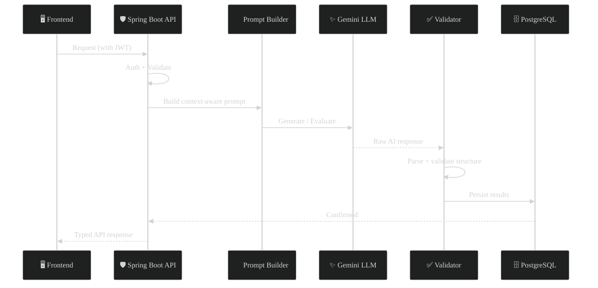
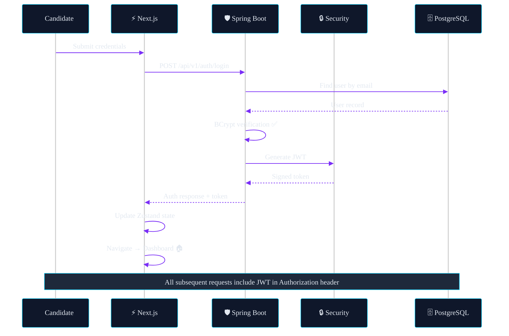
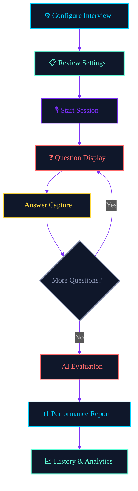
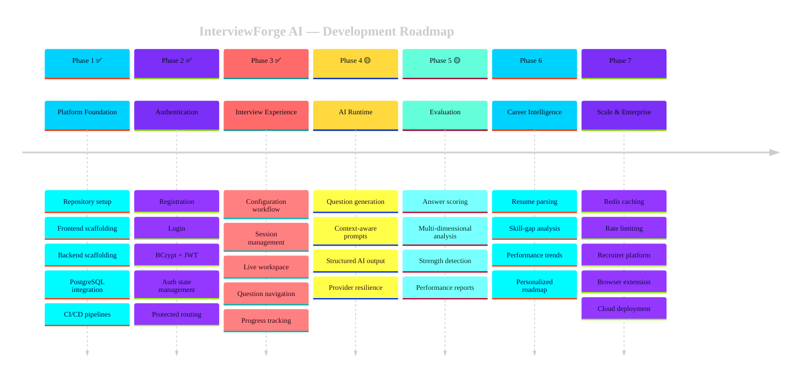

<!-- ============================================ -->
<!-- 🚀 INTERVIEWFORGE AI — ANIMATED README      -->
<!-- ============================================ -->

<a name="top"></a>

<div align="center">

<!-- Animated Header Banner -->


<!-- Badges Row 1: CI Status -->
<a href="https://github.com/Jawahar08/interviewforge-ai/actions/workflows/frontend-ci.yml"></a>
<a href="https://github.com/Jawahar08/interviewforge-ai/actions/workflows/backend-ci.yml"></a>


<br />

<!-- Badges Row 2: Frontend Stack -->


<br />

<!-- Badges Row 3: Backend Stack -->


<br /><br />

<!-- Animated Typing Effect -->
<a href="https://git.io/typing-svg"></a>

<br />

<!-- Tech Stack Icons -->
<p>
  
</p>

<br />

<!-- Quick Description -->
<p>
  <strong>InterviewForge AI</strong> is a production-oriented full-stack platform that simulates<br />
  realistic interviews, evaluates performance with AI, analyzes resumes,<br />
  and generates personalized career intelligence — all in one place.
</p>

<br />

<!-- Quick Links -->
<a href="#-quick-start"></a>
<a href="#%EF%B8%8F-architecture"></a>
<a href="#-features"></a>
<a href="#-api-reference"></a>
<a href="#%EF%B8%8F-roadmap"></a>

</div>

<br />

<!-- Wave Separator -->


<br />

<!-- ============================================ -->
<!-- PROBLEM & SOLUTION                           -->
<!-- ============================================ -->

## 🎯 The Problem

<table>
<tr>
<td width="50%">

### ❌ Traditional Interview Prep

```
😰 Memorize generic questions
📝 No measurable feedback
🔄 No improvement tracking
📉 No weakness detection
🤷 No personalized roadmap
```

</td>
<td width="50%">

### ✅ InterviewForge AI

```
🧠 AI-powered adaptive questions
📊 Multi-dimensional scoring
📈 Historical performance analytics
🎯 Weakness-to-strength pipeline
🗺️ Personalized career roadmap
```

</td>
</tr>
</table>

<br />

<!-- ============================================ -->
<!-- CORE PRODUCT FLOW                            -->
<!-- ============================================ -->

## 🔄 Core Product Flow

```mermaid
%%{init: {'theme': 'dark', 'themeVariables': { 'primaryColor': '#1e293b', 'primaryTextColor': '#e2e8f0', 'primaryBorderColor': '#00d2ff', 'lineColor': '#7b2ff7', 'secondaryColor': '#0f172a', 'tertiaryColor': '#162447', 'fontFamily': 'Segoe UI, sans-serif'}}}%%

flowchart LR
    A["🔐 Auth"] --> B["📊 Dashboard"]
    B --> C["⚙️ Configure"]
    C --> D["🎙️ Interview"]
    D --> E["🧠 AI Eval"]
    E --> F["📈 Report"]
    F --> G["🗺️ Roadmap"]
    G --> B

    style A fill:#0f172a,stroke:#00d2ff,stroke-width:2px,color:#00d2ff
    style B fill:#0f172a,stroke:#64ffda,stroke-width:2px,color:#64ffda
    style C fill:#0f172a,stroke:#7b2ff7,stroke-width:2px,color:#7b2ff7
    style D fill:#0f172a,stroke:#ff6b6b,stroke-width:2px,color:#ff6b6b
    style E fill:#0f172a,stroke:#ffd93d,stroke-width:2px,color:#ffd93d
    style F fill:#0f172a,stroke:#00d2ff,stroke-width:2px,color:#00d2ff
    style G fill:#0f172a,stroke:#64ffda,stroke-width:2px,color:#64ffda
```



<br />

<!-- ============================================ -->
<!-- ARCHITECTURE                                 -->
<!-- ============================================ -->

## 🏗️ Architecture



<br />

<details>
<summary><b>🔍 Architectural Principles (click to expand)</b></summary>
<br />

| # | Principle | Description |
|:-:|-----------|-------------|
| 🧩 | **Separation of Concerns** | Frontend, auth, interview state, persistence, and AI orchestration as independent layers |
| 🛡️ | **Backend-Owned AI** | AI providers never called from browser — keys protected, prompts centralized |
| 🏢 | **Domain-Driven Backend** | Modules organized by business capability, not generic folders |
| 🔐 | **Secure Auth Boundaries** | Identity derived from JWT, never from browser-supplied IDs |
| 📐 | **Incremental Architecture** | Each phase validated before adding complexity |

<br />



</details>

<br />

<!-- ============================================ -->
<!-- FEATURES                                     -->
<!-- ============================================ -->

## ✨ Features

<table>
<tr>
<td width="50%" valign="top">

### 🔐 Authentication System
> Secure, production-grade auth flow

- ✅ User registration with validation
- ✅ Login with credential verification
- ✅ BCrypt password hashing
- ✅ JWT token generation & validation
- ✅ Spring Security integration
- ✅ Protected API routes
- ✅ Centralized auth state (Zustand)

</td>
<td width="50%" valign="top">

### 🎙️ Interview Engine
> AI-powered interview simulation

- ✅ Multi-type interview configuration
- ✅ Dynamic session routing
- ✅ Unique session identifiers
- ✅ Pre-interview session review
- ✅ Live interview workspace
- ✅ Question progress tracking
- ✅ Typed answer capture

</td>
</tr>
<tr>
<td width="50%" valign="top">

### 🧠 AI Evaluation Pipeline
> Deep multi-dimensional analysis

- 🟡 Relevance scoring
- 🟡 Technical depth analysis
- 🟡 Clarity measurement
- 🟡 Accuracy verification
- 🟡 Communication quality
- 🟡 Problem-solving assessment
- 🟡 Completeness detection

</td>
<td width="50%" valign="top">

### 📄 Resume Intelligence
> Transform PDFs into career insights

- 🟡 PDF upload & extraction
- 🟡 Technical skill identification
- 🟡 Experience analysis
- 🟡 Project strength evaluation
- 🟡 Missing-skill detection
- 🟡 Role compatibility scoring
- 🟡 Improvement recommendations

</td>
</tr>
<tr>
<td width="50%" valign="top">

### 📊 Performance Analytics
> Data-driven interview intelligence

- 🟡 Historical performance tracking
- 🟡 Strength/weakness detection
- 🟡 Communication trend analysis
- 🟡 Role-specific readiness scores
- 🟡 Difficulty progression curves
- 🟡 Recommended next actions

</td>
<td width="50%" valign="top">

### 🗺️ Career Roadmap
> Personalized improvement path

- 🟡 Skill-gap identification
- 🟡 Targeted study plans
- 🟡 Interview performance trends
- 🟡 Difficulty-based progression
- 🔵 Redis caching layer
- 🔵 Browser extension
- 🔵 Recruiter analytics

</td>
</tr>
</table>

<div align="center">
<sub>✅ Implemented &nbsp;·&nbsp; 🟡 In Progress &nbsp;·&nbsp; 🔵 Planned</sub>
</div>

<br />

<!-- ============================================ -->
<!-- FEATURE STATUS TRACKER                       -->
<!-- ============================================ -->

<details>
<summary><b>📋 Detailed Feature Status Matrix (click to expand)</b></summary>
<br />

| Module | Capability | Status | Priority |
|:------:|:-----------|:------:|:--------:|
| 🔐 Auth | Registration flow | ✅ | `P0` |
| 🔐 Auth | Login flow | ✅ | `P0` |
| 🔐 Auth | BCrypt hashing | ✅ | `P0` |
| 🔐 Auth | JWT generation | ✅ | `P0` |
| 🖥️ Frontend | Landing experience | ✅ | `P0` |
| 🖥️ Frontend | Auth pages | ✅ | `P0` |
| 📊 Dashboard | Protected dashboard | ✅ | `P0` |
| 🎙️ Interview | Configuration workflow | ✅ | `P0` |
| 🎙️ Interview | Dynamic session routing | ✅ | `P0` |
| 🎙️ Interview | Pre-session review | ✅ | `P1` |
| 🎙️ Interview | Live workspace | ✅ | `P0` |
| 🎙️ Interview | Client session state | 🟡 | `P0` |
| 🧠 AI | Question generation | 🟡 | `P0` |
| 📝 Eval | AI answer scoring | 🟡 | `P0` |
| 📜 History | Interview history | 🟡 | `P1` |
| 📄 Resume | PDF intelligence | 🟡 | `P1` |
| 📈 Analytics | Performance aggregation | 🟡 | `P1` |
| ⚡ Redis | Caching layer | 🔵 | `P2` |
| 👔 Recruiter | Enterprise analytics | 🔵 | `P2` |
| 🧩 Extension | Job-context interviews | 🔵 | `P2` |

</details>

<br />

<!-- Wave Separator -->


<br />

<!-- ============================================ -->
<!-- TECH STACK                                   -->
<!-- ============================================ -->

## 🛠️ Tech Stack

<details open>
<summary><b>🖥️ Frontend</b></summary>
<br />

| Technology | Role | Version |
|:----------:|------|:-------:|
|  **Next.js** | App framework & routing | `16` |
|  **React** | Component architecture | `19` |
|  **TypeScript** | Static type safety | `5` |
|  **Tailwind CSS** | Responsive styling | `latest` |
| 🐻 **Zustand** | Client state management | `latest` |
| 📡 **Axios** | Typed HTTP client | `latest` |

</details>

<details open>
<summary><b>⚙️ Backend</b></summary>
<br />

| Technology | Role | Version |
|:----------:|------|:-------:|
|  **Java** | Core language | `17+` |
|  **Spring Boot** | REST framework | `latest` |
| 🛡️ **Spring Security** | Auth & authorization | `—` |
| 🔑 **JWT** | Stateless tokens | `—` |
| 🔐 **BCrypt** | Password hashing | `—` |
|  **Hibernate** | ORM | `—` |
|  **Maven** | Build system | `—` |
| 📄 **Swagger** | API documentation | `—` |

</details>

<details open>
<summary><b>🗄️ Data & Infrastructure</b></summary>
<br />

| Technology | Role |
|:----------:|------|
|  **PostgreSQL** | Primary database |
|  **Redis** | Caching (planned) |
|  **Docker** | Containerization |
|  **GitHub Actions** | CI/CD |
| ✨ **Gemini API** | AI intelligence |

</details>

<br />

<!-- ============================================ -->
<!-- PROJECT STRUCTURE                            -->
<!-- ============================================ -->

## 📁 Project Structure

<details>
<summary><b>🖥️ Frontend Architecture (click to expand)</b></summary>

```
frontend/
├── 📂 app/
│   ├── 🔐 auth/
│   │   ├── login/          # Login page
│   │   └── register/       # Registration page
│   │
│   ├── 📊 dashboard/       # Protected dashboard
│   ├── 📜 history/         # Interview history
│   ├── 🎙️ interview/
│   │   └── session/
│   │       └── [sessionId]/
│   │           ├── page.tsx        # Session review
│   │           └── live/
│   │               └── page.tsx    # Live interview
│   │
│   ├── 👤 profile/         # User profile
│   ├── 📄 resume/          # Resume workspace
│   ├── 🗺️ roadmap/        # Career roadmap
│   └── ⚙️ settings/       # App settings
│
├── 📂 features/
│   ├── 🔐 auth/            # Auth feature module
│   └── 🎙️ interview/
│       ├── api/            # API integration
│       ├── components/     # UI components
│       ├── store/          # Zustand stores
│       └── types/          # TypeScript types
│
├── 📂 shared/
│   ├── components/         # Reusable UI
│   ├── store/              # Global stores
│   └── utilities/          # Helper functions
│
└── 📂 lib/
    └── api/                # HTTP client config
```

</details>

<details>
<summary><b>⚙️ Backend Architecture (click to expand)</b></summary>

```
backend/
└── src/main/java/com/interviewforge/
    │
    ├── 🔐 auth/            # Authentication domain
    ├── 🛡️ security/        # Security configuration
    ├── 🎙️ interview/       # Interview domain
    ├── 📋 session/          # Session management
    ├── ❓ question/         # Question domain
    ├── 💬 answer/           # Answer domain
    ├── 🧠 ai/              # AI orchestration
    ├── 📊 dashboard/        # Dashboard domain
    ├── 🔧 common/           # Shared utilities
    └── ⚙️ configuration/   # App configuration
```

</details>

<br />

<!-- ============================================ -->
<!-- AUTH FLOW                                    -->
<!-- ============================================ -->

## 🔐 Authentication Flow



<br />

<!-- ============================================ -->
<!-- INTERVIEW ENGINE                             -->
<!-- ============================================ -->

## 🎙️ Interview Engine



### 🧠 AI Evaluation Dimensions

<table>
<tr>
<td align="center" width="14%">

**🎯**<br />Relevance

</td>
<td align="center" width="14%">

**🔬**<br />Technical<br />Depth

</td>
<td align="center" width="14%">

**💎**<br />Clarity

</td>
<td align="center" width="14%">

**✅**<br />Accuracy

</td>
<td align="center" width="14%">

**🗣️**<br />Communi-<br />cation

</td>
<td align="center" width="14%">

**🧩**<br />Problem<br />Solving

</td>
<td align="center" width="14%">

**📦**<br />Complete-<br />ness

</td>
</tr>
</table>

<br />

<!-- Wave Separator -->


<br />

<!-- ============================================ -->
<!-- API REFERENCE                                -->
<!-- ============================================ -->

## 📡 API Reference

<div align="center">
<sub>Base URL: <code>http://localhost:8080/api/v1</code> &nbsp;·&nbsp; Swagger: <code>http://localhost:8080/swagger-ui/index.html</code></sub>
</div>

<br />

<details>
<summary><b>🔐 Authentication</b></summary>

| Method | Endpoint | Description | Auth |
|:------:|----------|-------------|:----:|
| `POST` | `/auth/register` | Create new account | ❌ |
| `POST` | `/auth/login` | Authenticate user | ❌ |

**Register Request:**
```json
{
  "name": "Jane Doe",
  "email": "jane@example.com",
  "password": "SecureP@ssw0rd"
}
```

**Login Response:**
```json
{
  "success": true,
  "message": "Authentication successful",
  "data": {
    "token": "eyJhbGciOiJIUzI1NiIs...",
    "user": { "id": 1, "name": "Jane Doe", "email": "jane@example.com" }
  }
}
```

</details>

<details>
<summary><b>🎙️ Interviews</b></summary>

| Method | Endpoint | Description | Auth |
|:------:|----------|-------------|:----:|
| `POST` | `/interviews` | Create interview | 🔐 |
| `GET` | `/interviews` | List all interviews | 🔐 |
| `GET` | `/interviews/{id}` | Get interview details | 🔐 |

</details>

<details>
<summary><b>📋 Sessions</b></summary>

| Method | Endpoint | Description | Auth |
|:------:|----------|-------------|:----:|
| `POST` | `/sessions/start` | Start new session | 🔐 |
| `GET` | `/sessions/{sessionId}` | Get session state | 🔐 |

</details>

<details>
<summary><b>🧠 AI Engine</b></summary>

| Method | Endpoint | Description | Auth |
|:------:|----------|-------------|:----:|
| `POST` | `/ai/generate` | Generate AI questions | 🔐 |
| `POST` | `/answers/evaluate` | Evaluate answers | 🔐 |

</details>

<br />

### 📦 Standard Response Envelope

```json
{
  "success": true,
  "message": "Operation completed successfully",
  "data": { }
}
```

<br />

<!-- ============================================ -->
<!-- QUICK START                                  -->
<!-- ============================================ -->

## 🚀 Quick Start

### Prerequisites

```
Node.js 18+  ·  Java 17+  ·  Maven  ·  PostgreSQL  ·  Git
```

### 1️⃣ Clone & Setup Database

```bash
# Clone the repository
git clone https://github.com/Jawahar08/interviewforge-ai.git
cd interviewforge-ai

# Configure environment variables
export DB_URL=jdbc:postgresql://localhost:5432/interviewforge
export DB_USERNAME=postgres
export DB_PASSWORD=your_password
export JWT_SECRET=your_secure_jwt_secret
export GEMINI_API_KEY=your_api_key
```

### 2️⃣ Start Backend

```bash
cd backend
mvn clean compile
mvn spring-boot:run
# 🟢 API running at http://localhost:8080
# 📄 Swagger at http://localhost:8080/swagger-ui/index.html
```

### 3️⃣ Start Frontend

```bash
cd frontend
npm install
npm run dev
# 🟢 App running at http://localhost:3000
```

### 4️⃣ Validate

```bash
# Frontend type-check
npx tsc --noEmit

# Frontend production build
npm run build

# Backend full verification
mvn clean verify
```

> ⚠️ **Security Note:** Never commit production secrets or API keys to source control.

<br />

<!-- ============================================ -->
<!-- ROADMAP                                      -->
<!-- ============================================ -->

## 🗺️ Roadmap



<br />

<!-- ============================================ -->
<!-- SECURITY                                     -->
<!-- ============================================ -->

## 🔒 Security

<table>
<tr>
<td width="50%" valign="top">

### Implemented

- ✅ BCrypt password hashing
- ✅ JWT-based authentication
- ✅ Spring Security filters
- ✅ Protected backend endpoints
- ✅ Server-side AI API keys
- ✅ DTO validation
- ✅ Centralized exception handling

</td>
<td width="50%" valign="top">

### Planned

- 🔵 CORS hardening
- 🔵 Rate limiting
- 🔵 Request throttling
- 🔵 API key rotation
- 🔵 Audit logging
- 🔵 OWASP compliance
- 🔵 Security headers

</td>
</tr>
</table>

<br />

<!-- ============================================ -->
<!-- CONTRIBUTING                                  -->
<!-- ============================================ -->

## 🤝 Contributing

<details>
<summary><b>Contribution Workflow</b></summary>
<br />

```bash
# 1. Fork & clone
git clone https://github.com/YOUR_USERNAME/interviewforge-ai.git

# 2. Create feature branch
git checkout -b feature/amazing-feature

# 3. Make changes & validate
npx tsc --noEmit        # Frontend
mvn clean compile        # Backend

# 4. Commit with conventional commits
git commit -m "feat: add amazing feature"

# 5. Push & open PR
git push origin feature/amazing-feature
```

**Branch Strategy:**
```
main
 ├── frontend-development
 ├── backend-development
 └── feature/*
```

</details>

<br />

## 🌿 Git Conventions

| Prefix | Usage |
|:------:|-------|
| `feat:` | New feature |
| `fix:` | Bug fix |
| `refactor:` | Code restructuring |
| `docs:` | Documentation |
| `test:` | Tests |
| `chore:` | Maintenance |
| `perf:` | Performance |

<br />

<!-- ============================================ -->
<!-- AUTHOR & FOOTER                              -->
<!-- ============================================ -->

<div align="center">

<br />

## 👨‍💻 Author

### **Jawahar Bharathi**

**Full Stack Developer · AI Enthusiast · SaaS Builder**

Building production-grade applications across modern frontend systems,<br />
Java backend engineering, secure APIs, AI integration, and scalable SaaS.

<br />

<a href="https://github.com/Jawahar08"></a>

<br /><br />

<a href="#top"></a>

<br /><br />

<!-- Animated Footer -->


</div>


