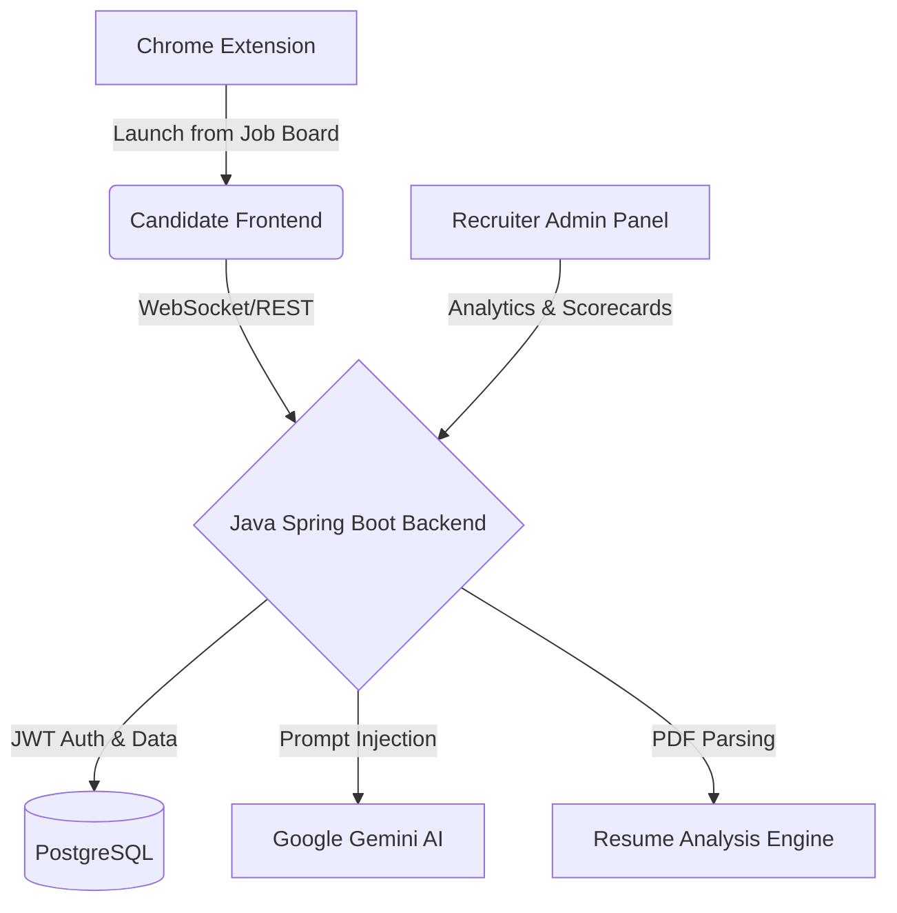

# 🚀 InterviewForge AI


> **An enterprise-grade, multi-service AI Interview Preparation Platform.**
> InterviewForge accelerates hiring and candidate preparation through hyper-realistic AI simulations, real-time speech-to-text evaluation, and deep PDF resume analysis.

---

## 🏗 The 4 Pillars Architecture

Unlike typical monolithic applications, InterviewForge AI is designed using a modern microservice-style ecosystem. 



### 1. 🖥️ Candidate Interface (`/frontend`)
The main portal for job seekers. Designed with a stunning, immersive dark-mode glassmorphic aesthetic to put candidates at ease while feeling futuristic.
- **Voice-Native:** Speak answers out loud using native Web Speech API recognition.
- **Webcam Feed:** A live, integrated video feed simulates the pressure of a real interview.
- **Dynamic AI Personas:** The AI adapts its tone and technical depth based on the candidate's answers.

### 2. 🛡️ Core Backend Engine (`/backend`)
A rock-solid, highly-scalable Java 21 Spring Boot application serving as the brain.
- **Security First:** Full Spring Security implementation with Stateless JWT Authentication and BCrypt.
- **AI Orchestration:** Abstracts the complexities of talking to Google Gemini, handling prompt generation, retry logic, and JSON parsing of scorecards.
- **Document Processing:** Integrates Apache PDFBox to deeply analyze uploaded resumes, extract semantic skills, and find career gaps.

### 3. 📊 Recruiter Dashboard (`/admin-panel`)
A separate, high-contrast Enterprise React application optimized for HR professionals.
- **Pipeline Analytics:** Track hundreds of candidate scores, pass/fail rates, and time-to-hire metrics.
- **Session Review:** Recruiters can view full transcripts, AI-generated weaknesses/strengths, and candidate recordings.

### 4. 🌐 Browser Extension (`/extension`)
A lightweight Manifest V3 Chrome Extension bridging the gap between discovery and practice.
- **Contextual Practice:** Highlight a job description on LinkedIn, right-click, and select "Start Mock Interview". The extension passes the context directly to the AI to generate job-specific technical questions.

---

## ✨ Comprehensive Feature Matrix

<details>
<summary><b>Click to expand: Core Modules & Status</b></summary>

| Module | Core Functionality | Status |
|---|---|:---:|
| **Authentication** | JWT Generation, Registration, Login, Protected Routes | ✅ |
| **Session Engine** | Start/Stop interviews, state tracking, duration metrics | ✅ |
| **Voice & Video** | Browser `getUserMedia` integration, Speech-to-text | ✅ |
| **Generative AI** | Google Gemini connection, dynamic prompt crafting | ✅ |
| **Evaluation System** | Real-time answer scoring, weakness detection | ✅ |
| **Resume Parser** | PDF text extraction, skill mapping, gap detection | ✅ |
| **Extension** | Context Menu injection, local storage state passing | ✅ |
| **Admin Analytics** | Score aggregations, tabular candidate views | ✅ |

</details>

---

## 📡 Core API Reference

The backend exposes a highly structured, RESTful API. Below is a subset of the critical endpoints.

### Authentication & Profiles
* `POST /api/v1/auth/register` — Create a new candidate/recruiter account.
* `POST /api/v1/auth/login` — Exchange credentials for a JWT token.
* `GET /api/v1/profile` — Fetch protected user data and career goals.

### AI & Interview Sessions
* `POST /api/v1/sessions/start` — Initialize a new tracked interview session.
* `POST /api/v1/ai/generate` — Ask Gemini to generate the next question based on transcript history.
* `POST /api/v1/answers/evaluate` — Submit a spoken/typed answer for AI grading and feedback.

### Resume & Context
* `POST /api/v1/resume/upload` — Upload a PDF file securely.
* `POST /api/v1/resume/analyze-pdf` — Extract text and run deep AI analysis for skill matching.

---

## 🚀 Local Quickstart Guide

Want to run the entire cluster locally? Follow these steps:

### 1. Database & Environment
1. Ensure PostgreSQL is running locally on port `5432`.
2. Set your environment variables in your terminal:
   ```bash
   export DB_PASSWORD=your_postgres_password
   export JWT_SECRET=your_super_secret_jwt_key
   export GEMINI_API_KEY=your_google_ai_studio_key
   ```

### 2. Boot the Backend (Port 8080)
```bash
cd backend
mvn clean install
mvn spring-boot:run
```
*(Swagger UI is generated at `http://localhost:8080/swagger-ui/index.html`)*

### 3. Launch the Candidate App (Port 5173)
```bash
cd frontend
npm install
npm run dev
```

### 4. Launch the Recruiter Admin (Port 5174)
```bash
cd admin-panel
npm install
npm run dev
```

### 5. Clean the Workspace
To clean all built artifacts and `node_modules` across the monorepo:
```bash
make clean
```

### 6. Install the Extension
1. Open Chrome and navigate to `chrome://extensions/`.
2. Toggle **Developer mode** ON.
3. Click **Load unpacked** and select the `/extension` directory.

---

## 🔐 Security Standards
* **Data Encryption:** All sensitive endpoints require `Bearer` token authorization.
* **Password Hashing:** Implemented `BCryptPasswordEncoder` with a high work factor.
* **CORS:** Cross-Origin Resource Sharing is strictly configured to only allow traffic from the local frontend/admin ports during development.

---

<div align="center">
  <i>"Accelerate hire. Unlock human potential. Build the future of teams."</i><br>
  <b>Built by Jawahar Bharathi</b>
</div>