<!-- ╔══════════════════════════════════════════════════════════════════════════╗ -->
<!-- ║            ⚡ INTERVIEWFORGE AI — THE ULTIMATE README                  ║ -->
<!-- ╚══════════════════════════════════════════════════════════════════════════╝ -->

<a name="top"></a>

<div align="center">

<!-- ─────────── ANIMATED WAVE HEADER ─────────── -->


<!-- ─────────── ANIMATED TYPING TERMINAL ─────────── -->

<a href="https://git.io/typing-svg"></a>

<br /><br />

<!-- ─────────── SHIELD.IO BADGES ─────────── -->

[](https://github.com/Jawahar08/interviewforge-ai/actions/workflows/frontend-ci.yml)
[](https://github.com/Jawahar08/interviewforge-ai/actions/workflows/backend-ci.yml)


<br />

<!-- ─────────── TECH STACK ICONS ─────────── -->


<br /><br />

<!-- ─────────── ANIMATED STATS COUNTERS ─────────── -->

<table>
<tr>
<td align="center"><h1>30+</h1><sub>Career Roles</sub></td>
<td align="center"><h1>6</h1><sub>Interview Types</sub></td>
<td align="center"><h1>12</h1><sub>Target Companies</sub></td>
<td align="center"><h1>24</h1><sub>Backend Domains</sub></td>
<td align="center"><h1>∞</h1><sub>AI Questions</sub></td>
</tr>
</table>

<br />

> **InterviewForge AI** is a production-grade, full-stack platform that simulates realistic AI-powered interviews across **30+ career domains**, evaluates answers with multi-dimensional scoring, provides ATS resume intelligence, generates personalized career roadmaps, and offers **company-targeted premium prep for FAANG & top-tier companies** — all driven by **Google Gemini 2.5 Flash**.

<br />

<!-- ─────────── NAVIGATION PILLS ─────────── -->

<a href="#-the-problem"></a>
<a href="#-features-at-a-glance"></a>
<a href="#-premium-company-prep"></a>
<a href="#%EF%B8%8F-system-architecture"></a>
<a href="#-ai-pipeline-deep-dive"></a>
<a href="#-cicd-pipeline"></a>
<a href="#-tech-stack"></a>
<a href="#-quick-start"></a>
<a href="#-api-cheatsheet"></a>

</div>

<br />

<!-- ═══════════════════════════ GRADIENT SEPARATOR ═══════════════════════════ -->


<br />

## 💡 The Problem

```
Monday:    "I have a Google interview next week. Where do I even start?"
Tuesday:   "I practiced 200 random LeetCode problems. None were relevant."
Wednesday: "My resume got auto-rejected by the ATS. Again."
Thursday:  "I bombed the behavioral round. I didn't know STAR format existed."
Friday:    ✅ You deployed InterviewForge on Monday. You aced every round.
```

<table>
<tr>
<td width="50%">

### ❌ Traditional Interview Prep

```diff
- 😰 Generic question lists with zero personalization
- 📝 No structured, measurable feedback on answers
- 🔄 Zero improvement tracking across sessions
- 📉 No weakness detection or skill-gap analysis
- 🤷 No career roadmap or progression guidance
- 🏢 No company-specific preparation available
- 🧠 No AI — just blind memorization
```

</td>
<td width="50%">

### ✅ InterviewForge AI

```diff
+ 🧠 AI-generated questions tailored to YOUR role & domain
+ 📊 Multi-dimensional scoring (technical, clarity, depth)
+ 📈 Historical performance analytics & trend tracking
+ 🎯 Weakness-to-strength detection pipeline
+ 🗺️ AI-powered personalized career roadmap
+ 📄 ATS resume intelligence with skill-gap analysis
+ 🏢 FAANG company-targeted premium prep (Google, Meta, Amazon...)
+ 💎 Premium tier with instant mock upgrade flow
```

</td>
</tr>
</table>

<br />

<!-- ═══════════════════════════ GRADIENT SEPARATOR ═══════════════════════════ -->


<br />

## ✨ Features at a Glance

<div align="center">

```
╔═══════════════════╦═══════════════════╦═══════════════════╦═══════════════════╗
║   🔐 Secure       ║   🎙️ Interview    ║   🧠 AI Engine    ║   📄 Resume       ║
║   Auth System     ║   Simulator       ║   (Gemini 2.5)    ║   Intelligence    ║
╠═══════════════════╬═══════════════════╬═══════════════════╬═══════════════════╣
║   📊 Dashboard    ║   📜 Session       ║   🗺️ Career      ║   💎 Premium      ║
║   Analytics       ║   History         ║   Roadmap         ║   Company Prep    ║
╠═══════════════════╬═══════════════════╬═══════════════════╬═══════════════════╣
║   👤 Profile      ║   ⚙️ Settings     ║   🏢 12 Companies ║   📈 Results &    ║
║   Manager         ║   AI Config       ║   FAANG + More    ║   Score Tracking  ║
╚═══════════════════╩═══════════════════╩═══════════════════╩═══════════════════╝
```

</div>

<table>
<tr>
<td width="50%" valign="top">

### 🔐 Authentication & Security
> Production-grade auth with zero compromises

- ✅ User registration with Zod + Jakarta Bean validation
- ✅ Login with BCrypt password hashing (adaptive cost)
- ✅ Stateless JWT token authentication (HMAC-SHA256)
- ✅ Spring Security filter chain with custom filters
- ✅ Protected API routes + frontend `ProtectedRoute` guards
- ✅ Centralized auth state via Zustand (persisted)
- ✅ Server-side Gemini API key protection

</td>
<td width="50%" valign="top">

### 🎙️ AI Interview Simulator
> Realistic mock interviews across 30+ roles

- ✅ **6 domain categories** with **30+ target roles**
- ✅ **Custom role input** — type ANY job title
- ✅ 6 interview types (Technical, Behavioral, Case Study, Stress & Ethics, System Design, Mixed)
- ✅ 3 difficulty tiers (Easy → Medium → Hard)
- ✅ Live interview workspace with progress tracking
- ✅ Real-time question navigation & answer capture
- ✅ Pre-session review & configuration dashboard

</td>
</tr>
<tr>
<td width="50%" valign="top">

### 🧠 AI Evaluation Pipeline
> Multi-dimensional answer analysis powered by Gemini

- ✅ Real-time answer scoring (0–10 scale)
- ✅ Strengths & weaknesses breakdown per answer
- ✅ Improvement suggestions with actionable feedback
- ✅ Technical correctness verification
- ✅ Relevance, clarity & completeness detection
- ✅ Communication quality assessment
- ✅ Overall session score aggregation

</td>
<td width="50%" valign="top">

### 📄 Resume Intelligence (ATS)
> Transform your PDF into career insights

- ✅ PDF upload & Apache PDFBox text extraction
- ✅ AI-powered ATS compatibility scoring (0–100)
- ✅ Technical skill identification & gap analysis
- ✅ Experience analysis & strength evaluation
- ✅ Missing skill detection for target role
- ✅ Role compatibility scoring
- ✅ Actionable improvement recommendations

</td>
</tr>
<tr>
<td width="50%" valign="top">

### 🗺️ AI Career Roadmap
> Personalized learning timeline with task tracking

- ✅ AI-generated weekly study plans
- ✅ Interactive task checklist with progress tracking
- ✅ Capstone project recommendations
- ✅ Curated learning resources & links
- ✅ Readiness score gauge
- ✅ Estimated preparation duration
- ✅ Reset & regenerate capability

</td>
<td width="50%" valign="top">

### 📊 Dashboard & Analytics
> Data-driven interview intelligence hub

- ✅ Overall performance metrics dashboard
- ✅ Average / best / lowest score tracking
- ✅ Total interviews, questions & answers counters
- ✅ Historical interview results timeline
- ✅ Resume upload history
- ✅ Quick-action navigation cards
- ✅ Responsive glassmorphism UI with micro-animations

</td>
</tr>
</table>

<br />

### 🌍 Supported Career Domains & Roles

<div align="center">

| Domain | Available Roles |
|:------:|:----------------|
| 💻 **Tech & CS** | Full Stack Developer · Backend Developer · Frontend Developer · Software Engineer · DevOps Engineer · Data Scientist · Cybersecurity Analyst |
| 💼 **Business** | Product Manager · Project Manager · Business Analyst · Management Consultant |
| 🧠 **Psychology & HR** | Clinical Psychologist · HR Manager · UX Researcher · Career Counselor |
| 🏥 **Healthcare & Science** | Medical Doctor · Registered Nurse · Physiotherapist · Research Scientist |
| 💰 **Finance & Marketing** | Financial Analyst · Marketing Manager · Accountant · Sales Representative |
| 📚 **Education & Writing** | Teacher · Content Writer · Social Worker |
| ✏️ **Custom / Other** | _Type any role you want — Chef, Pilot, Civil Engineer, Architect, etc._ |

</div>

<br />

### 🎭 Interview Types

<div align="center">

| Type | Focus Area |
|:----:|:-----------|
| 🔬 **Technical / Domain-Specific** | Core knowledge, tools, concepts, technical problem-solving |
| 🎭 **Behavioral / Situational** | STAR responses, leadership, teamwork, conflict resolution |
| 📋 **Case Study & Analysis** | Real-world scenario analysis, structured thinking |
| ⚡ **Stress & Ethical Scenario** | Pressure handling, ethical decision-making |
| 🏗️ **System & Process Design** | Architecture, workflow design, scalability thinking |
| 🔀 **Mixed / Comprehensive** | Balanced blend of all interview styles |

</div>

<br />

<!-- ═══════════════════════════ GRADIENT SEPARATOR ═══════════════════════════ -->


<br />

## 💎 Premium Company Prep

> **Company-Targeted Mock Interview Preparation** — a paid feature that tailors AI-generated interview questions to the specific hiring bar, technical standards, cultural values, and interview loop style of top-tier companies.

<div align="center">

```
┌──────────────────────────────────────────────────────────────────┐
│                  🏢  SUPPORTED COMPANIES                         │
│                                                                  │
│   🚀 General    G  Google     AM Amazon     M  Meta              │
│   MS Microsoft  🍎 Apple      N  Netflix    S  Stripe            │
│   U  Uber       Z  Zoho       T  TCS        I  Infosys           │
│                                                                  │
│   🔒 Locked for free users  ·  💎 Unlocked for Premium members   │
└──────────────────────────────────────────────────────────────────┘
```

</div>

### How It Works

```mermaid
%%{init: {'theme': 'dark', 'themeVariables': { 'primaryColor': '#1e293b', 'primaryTextColor': '#e2e8f0', 'primaryBorderColor': '#ffd93d', 'lineColor': '#7b2ff7', 'fontFamily': 'JetBrains Mono, monospace'}}}%%

flowchart LR
    A["🔒 Free User\nClicks Google"] --> B{"💎 Premium\nCheck"}
    B -->|"❌ Not Premium"| C["🪟 Upgrade Modal\n$19/mo Pro Plan"]
    C --> D["💳 Mock Payment\nPOST /profile/upgrade"]
    D --> E["✅ isPremium = true\nZustand + DB Updated"]
    E --> F["🔓 All Companies\nUnlocked"]
    B -->|"✅ Premium"| F
    F --> G["🧠 Gemini Prompt\n+ Company Context"]
    G --> H["🎙️ Company-Tailored\nInterview Session"]

    style A fill:#0f172a,stroke:#ff6b6b,stroke-width:2px,color:#ff6b6b
    style B fill:#0f172a,stroke:#ffd93d,stroke-width:2px,color:#ffd93d
    style C fill:#0f172a,stroke:#7b2ff7,stroke-width:2px,color:#7b2ff7
    style D fill:#0f172a,stroke:#00d2ff,stroke-width:2px,color:#00d2ff
    style E fill:#0f172a,stroke:#64ffda,stroke-width:2px,color:#64ffda
    style F fill:#0f172a,stroke:#ffd93d,stroke-width:2px,color:#ffd93d
    style G fill:#0f172a,stroke:#7b2ff7,stroke-width:2px,color:#7b2ff7
    style H fill:#0f172a,stroke:#64ffda,stroke-width:2px,color:#64ffda
```

### Premium vs Free

```diff
+ ✅ FREE TIER                               💎 PREMIUM TIER ($19/mo)
+ ──────────────────────────                 ──────────────────────────
+ General role-based interview prep          Everything in Free, plus:
+ 30+ career domains                        + Google, Meta, Amazon, Apple prep
+ 6 interview types                         + Microsoft, Netflix, Stripe prep
+ AI evaluation & scoring                   + Uber, Zoho, TCS, Infosys prep
+ Resume ATS analysis                       + Company-tailored AI prompt context
+ Career roadmap generation                 + Cultural fit & loop-style questions
+ Dashboard analytics                       + Unlimited premium sessions
+ Interview history                         + Priority question generation
```

<br />

<!-- ═══════════════════════════ GRADIENT SEPARATOR ═══════════════════════════ -->


<br />

## 🏗️ System Architecture

### High-Level Overview

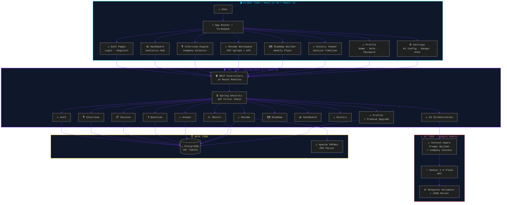

<br />

### 🔄 Core Product Flow

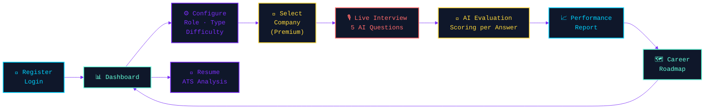

<br />

### 🗄️ Database Entity-Relationship Diagram

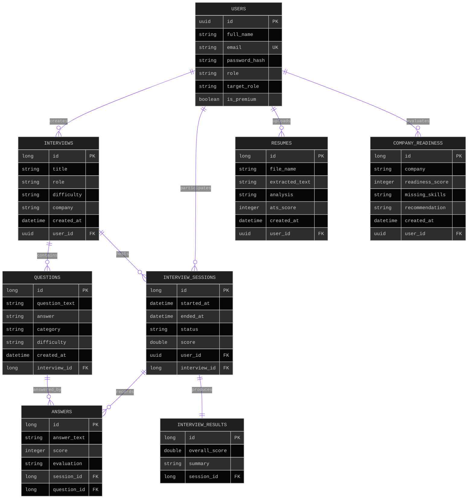

<br />

<!-- ═══════════════════════════ GRADIENT SEPARATOR ═══════════════════════════ -->


<br />

## 🧠 AI Pipeline Deep Dive

### Question Generation Pipeline

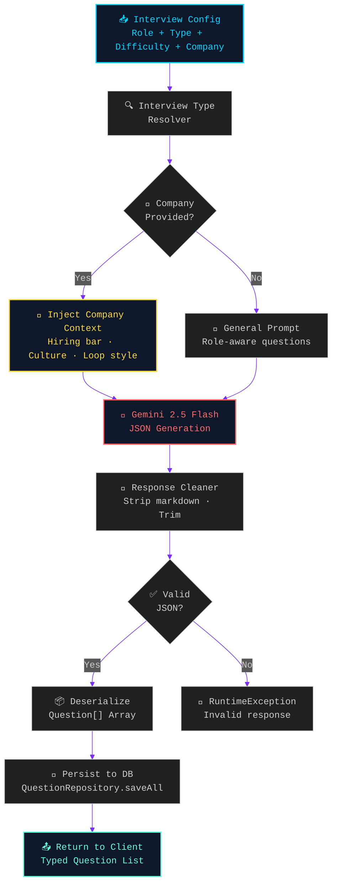

### Answer Evaluation Pipeline

```mermaid
%%{init: {'theme': 'dark', 'themeVariables': { 'primaryColor': '#1e293b', 'primaryTextColor': '#e2e8f0', 'primaryBorderColor': '#64ffda', 'lineColor': '#7b2ff7', 'fontFamily': 'JetBrains Mono, monospace'}}}%%

flowchart LR
    A["💬 User Answer\nText Input"] --> B["📝 Build Eval Prompt\nQuestion + Answer + Role Context"]
    B --> C["🧠 Gemini 2.5\nMulti-Dimensional Scoring"]
    C --> D["📊 Parse Score\n0-10 Scale"]
    D --> E["📋 Extract Breakdown\nStrengths · Weaknesses · Suggestions"]
    E --> F["💾 Persist\nAnswer + Evaluation"]
    F --> G["📤 Real-time\nFeedback to UI"]

    style A fill:#0f172a,stroke:#00d2ff,stroke-width:2px,color:#00d2ff
    style C fill:#0f172a,stroke:#ff6b6b,stroke-width:2px,color:#ff6b6b
    style G fill:#0f172a,stroke:#64ffda,stroke-width:2px,color:#64ffda
```

### Resume Analysis Pipeline

```mermaid
%%{init: {'theme': 'dark', 'themeVariables': { 'primaryColor': '#1e293b', 'primaryTextColor': '#e2e8f0', 'primaryBorderColor': '#7b2ff7', 'lineColor': '#00d2ff', 'fontFamily': 'JetBrains Mono, monospace'}}}%%

flowchart LR
    A["📄 PDF Upload\nMultipart Form"] --> B["📑 PDFBox\nText Extraction"]
    B --> C["🧠 Gemini AI\nATS Analysis Prompt"]
    C --> D["📊 ATS Score\n0-100"]
    D --> E["🔍 Skill Gap\nDetection"]
    E --> F["📝 Improvement\nRecommendations"]
    F --> G["💾 Persist\nResume + Analysis"]

    style A fill:#0f172a,stroke:#00d2ff,stroke-width:2px,color:#00d2ff
    style C fill:#0f172a,stroke:#ff6b6b,stroke-width:2px,color:#ff6b6b
    style G fill:#0f172a,stroke:#64ffda,stroke-width:2px,color:#64ffda
```

<br />

<details>
<summary><b>🔍 Full Request Lifecycle — Sequence Diagram (click to expand)</b></summary>
<br />

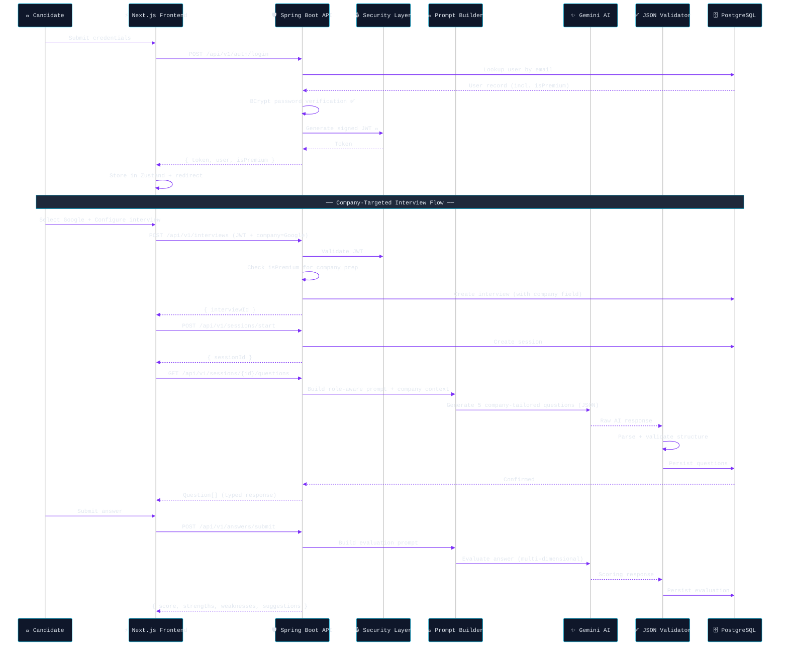

</details>

<br />

<details>
<summary><b>🔐 Authentication Flow — Detailed (click to expand)</b></summary>
<br />

```mermaid
%%{init: {'theme': 'dark', 'themeVariables': { 'actorBkg': '#0f172a', 'actorBorder': '#00d2ff', 'actorTextColor': '#e2e8f0', 'signalColor': '#7b2ff7', 'signalTextColor': '#e2e8f0', 'fontFamily': 'JetBrains Mono, monospace'}}}%%

sequenceDiagram
    participant C as 👤 Candidate
    participant F as ⚡ Next.js
    participant B as 🛡️ Spring Boot
    participant S as 🔒 Spring Security
    participant D as 🗄️ PostgreSQL

    rect rgb(15, 23, 42)
        Note over C,D: Registration Flow
        C->>F: Fill registration form
        F->>F: Zod schema validation
        F->>B: POST /api/v1/auth/register
        B->>B: Validate DTO (Jakarta)
        B->>B: Hash password (BCrypt)
        B->>D: INSERT user (isPremium=false)
        D-->>B: Created
        B-->>F: { token, user, isPremium }
        F->>F: Zustand auth store update
        F->>F: Redirect → /dashboard
    end

    rect rgb(15, 23, 42)
        Note over C,D: Login Flow
        C->>F: Submit credentials
        F->>B: POST /api/v1/auth/login
        B->>D: SELECT user by email
        D-->>B: User record
        B->>B: BCrypt.matches() ✅
        B->>S: Generate JWT (HMAC-SHA256)
        S-->>B: Signed token
        B-->>F: { token, user, isPremium }
        F->>F: Update Zustand + redirect
    end

    rect rgb(15, 23, 42)
        Note over C,D: Protected API Requests
        C->>F: Navigate to protected page
        F->>F: ProtectedRoute guard check
        F->>B: GET /api/v1/dashboard (Authorization: Bearer ...)
        B->>S: JwtAuthenticationFilter
        S->>S: Validate signature + expiry
        S-->>B: SecurityContext populated
        B->>D: Query user data
        D-->>B: Results
        B-->>F: Typed ApiResponse envelope
    end
```

</details>

<br />

<details>
<summary><b>🎙️ Interview Engine — Full Lifecycle (click to expand)</b></summary>
<br />

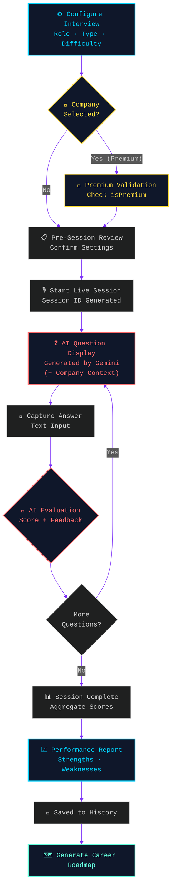

</details>

<br />

<!-- ═══════════════════════════ GRADIENT SEPARATOR ═══════════════════════════ -->


<br />

## 🔄 CI/CD Pipeline

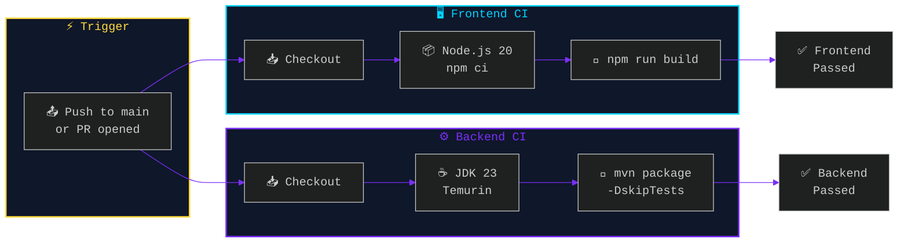

**Workflows:**

| Pipeline | File | Trigger | Steps |
|:--------:|:----:|:-------:|:------|
| 🖥️ Frontend CI | `.github/workflows/frontend-ci.yml` | Push/PR to `main` | Checkout → Node 20 → `npm ci` → `npm run build` |
| ⚙️ Backend CI | `.github/workflows/backend-ci.yml` | Push/PR to `main` | Checkout → JDK 23 → Maven cache → `mvn package -DskipTests` |

<br />

<!-- ═══════════════════════════ GRADIENT SEPARATOR ═══════════════════════════ -->


<br />

## 🛠️ Tech Stack

<div align="center">

```
    ┌──────────────────────────────────────────────────────────────────────┐
    │                      INTERVIEWFORGE AI STACK                         │
    │                                                                      │
    │  ┌──────────────┐  ┌──────────────┐  ┌────────────────────────┐    │
    │  │   FRONTEND   │  │   BACKEND    │  │      INTELLIGENCE      │    │
    │  │              │  │              │  │                        │    │
    │  │  Next.js 16  │  │ Spring Boot 3│  │  Google Gemini 2.5     │    │
    │  │  React 19    │  │ Java 23      │  │  Flash API             │    │
    │  │  TypeScript 5│  │ Hibernate    │  │                        │    │
    │  │  Tailwind CSS│  │ Spring Sec   │  │  Apache PDFBox         │    │
    │  │  Zustand     │  │ JWT (JJWT)   │  │  (Resume Parsing)     │    │
    │  │  Axios       │  │ BCrypt       │  │                        │    │
    │  │  Radix UI    │  │ Swagger/OAS  │  │                        │    │
    │  │  Lucide Icons│  │ Maven        │  │                        │    │
    │  │  Sonner Toast│  │ Flyway       │  │                        │    │
    │  └──────┬───────┘  └──────┬───────┘  └───────────┬────────────┘    │
    │         │                 │                       │                  │
    │         └────────┬────────┴───────────────────────┘                  │
    │                  │                                                    │
    │           ┌──────┴───────┐    ┌──────────────┐                      │
    │           │  PostgreSQL  │    │ GitHub Actions│                      │
    │           │  Database    │    │ CI/CD         │                      │
    │           └──────────────┘    └──────────────┘                      │
    └──────────────────────────────────────────────────────────────────────┘
```

</div>

<details open>
<summary><b>🖥️ Frontend</b></summary>
<br />

| Technology | Role | Version |
|:----------:|------|:-------:|
|  **Next.js** | App Router framework + Turbopack | `16` |
|  **React** | Component architecture | `19` |
|  **TypeScript** | End-to-end type safety | `5` |
|  **Tailwind CSS** | Utility-first responsive styling | `latest` |
| 🐻 **Zustand** | Lightweight client state management (persisted) | `latest` |
| 📡 **Axios** | Typed HTTP client with JWT interceptors | `latest` |
| ✨ **Radix UI** | Accessible primitive components (Dialog, Tabs, etc.) | `latest` |
| 🔔 **Sonner** | Toast notification system | `latest` |
| ✨ **Lucide React** | Beautiful icon library | `latest` |
| 📝 **Zod** | Runtime schema validation | `latest` |
| 📋 **React Hook Form** | Performant form management | `latest` |

</details>

<details open>
<summary><b>⚙️ Backend</b></summary>
<br />

| Technology | Role | Version |
|:----------:|------|:-------:|
|  **Java** | Core language | `23` |
|  **Spring Boot** | REST API framework | `3.x` |
| 🛡️ **Spring Security** | Authentication & authorization | `—` |
| 🔑 **JWT (JJWT)** | Stateless token authentication | `—` |
| 🔐 **BCrypt** | Adaptive password hashing | `—` |
|  **Hibernate/JPA** | ORM & database abstraction | `—` |
|  **Maven** | Dependency management & build | `—` |
| 📄 **SpringDoc OpenAPI** | Auto-generated Swagger docs | `—` |
| 🏗️ **Lombok** | Boilerplate reduction | `—` |
| ✈️ **Flyway** | Database migrations | `—` |

</details>

<details open>
<summary><b>🗄️ Data & AI</b></summary>
<br />

| Technology | Role |
|:----------:|------|
|  **PostgreSQL** | Primary relational database (10+ tables) |
| ✨ **Google Gemini 2.5 Flash** | AI question generation, answer evaluation, resume analysis, roadmap generation, company-targeted prep |
| 📑 **Apache PDFBox** | PDF text extraction for resume analysis |
|  **Docker** | Containerization |
|  **GitHub Actions** | CI/CD pipelines (Frontend + Backend) |

</details>

<br />

<!-- ═══════════════════════════ GRADIENT SEPARATOR ═══════════════════════════ -->


<br />

## 📁 Project Structure

<details>
<summary><b>🖥️ Frontend — Feature-Sliced Architecture (click to expand)</b></summary>

```
frontend/
├── 📂 app/                          # Next.js App Router
│   ├── 🏠 page.tsx                  # Landing page (public)
│   ├── 🎨 globals.css               # Global styles
│   ├── 📐 layout.tsx                # Root layout
│   │
│   ├── 🔐 auth/
│   │   ├── login/page.tsx           # Login page (Zod validated)
│   │   └── register/page.tsx        # Registration page
│   │
│   ├── 📊 (protected)/              # Auth-guarded layout group
│   │   ├── layout.tsx               # Sidebar + header layout
│   │   ├── dashboard/page.tsx       # Analytics dashboard
│   │   ├── history/page.tsx         # Interview history
│   │   ├── profile/page.tsx         # Profile management (name, role, password)
│   │   └── settings/page.tsx        # AI config, notifications, danger zone
│   │
│   ├── 🎙️ interview/
│   │   ├── page.tsx                 # Interview setup (role/type/difficulty/company)
│   │   └── session/[sessionId]/
│   │       ├── page.tsx             # Pre-session review
│   │       ├── live/page.tsx        # Live interview workspace
│   │       └── result/page.tsx      # Performance report
│   │
│   ├── 📄 resume/page.tsx           # Resume upload & ATS analysis
│   └── 🗺️ roadmap/page.tsx         # AI career roadmap builder
│
├── 📂 features/                     # Feature-sliced modules
│   ├── 🔐 auth/                     # Auth hooks, API, store, types
│   ├── 📊 dashboard/                # Dashboard API, hooks, types
│   ├── 📜 history/                  # History API, components, types
│   ├── 🎙️ interview/               # Interview API, components, schemas, store, types
│   │   └── components/
│   │       └── InterviewSetupForm   # Company selector + upgrade modal
│   ├── 👤 profile/                  # Profile form, hooks, API, types
│   ├── 📈 result/                   # Result API, components, types
│   ├── 📄 resume/                   # Resume API, hooks, types
│   ├── 🗺️ roadmap/                 # Roadmap API, components, types
│   └── ⚙️ settings/                # Settings form, hooks, types (AI config + danger zone)
│
├── 📂 shared/                       # Shared/reusable code
│   ├── components/                  # Auth guards, sidebar, header, UI primitives
│   ├── store/                       # Global Zustand stores (auth.store, app.store)
│   └── utilities/                   # Helper functions
│
└── 📂 lib/
    └── api/client.ts                # Axios instance with JWT interceptor
```

</details>

<details>
<summary><b>⚙️ Backend — Domain-Driven Architecture (click to expand)</b></summary>

```
backend/src/main/java/com/interviewforge/
│
├── 🚀 BackendApplication.java       # Spring Boot entry point
│
├── 🔐 auth/                         # Authentication domain
│   ├── controller/                  # AuthController (login, register)
│   ├── dto/                         # LoginRequest, RegisterRequest, AuthResponse (+isPremium)
│   ├── entity/                      # User (UUID id, isPremium, targetRole)
│   ├── repository/                  # UserRepository
│   └── service/                     # AuthService (BCrypt, JWT generation)
│
├── 🛡️ security/                     # Security configuration
│   ├── SecurityConfig.java          # Filter chain, CORS, route rules
│   ├── JwtAuthenticationFilter.java # Token extraction + validation
│   └── JwtTokenProvider.java        # JWT sign/verify utilities
│
├── 🎙️ interview/                    # Interview domain
│   ├── controller/                  # InterviewController
│   ├── dto/                         # CreateInterviewRequest (+company field)
│   ├── entity/                      # Interview (title, role, difficulty, company)
│   ├── repository/                  # InterviewRepository
│   └── service/                     # InterviewService (+premium validation)
│
├── 📋 session/                       # Session management domain
├── ❓ question/                      # Question domain
├── 💬 answer/                        # Answer domain (submit + AI evaluate)
│
├── 🧠 ai/                           # AI orchestration layer
│   ├── gemini/                      # GeminiService (API integration + mock handler)
│   └── service/                     # AIQuestionService (prompt builder + company context)
│
├── 📄 resume/                        # Resume intelligence domain (PDF + ATS)
├── 🗺️ roadmap/                      # Learning roadmap domain
├── 📈 result/                        # Interview result domain
├── 📊 dashboard/                     # Dashboard analytics
├── 📜 history/                       # Interview history domain
├── 📉 statistics/                    # Statistics aggregation
│
├── 👤 profile/                       # User profile domain
│   ├── controller/                  # ProfileController (GET, PUT, DELETE, POST /upgrade)
│   ├── dto/                         # ProfileUpdateRequest, UserProfileResponse (+isPremium)
│   └── service/                     # ProfileService (+upgradeToPremium, clearInterviews, clearResumes)
│
├── 💼 company/                       # Company readiness domain
├── 🎯 jobmatch/                      # Job matching domain
├── 📋 recommendation/                # AI recommendations
├── 📊 report/                        # Report generation
├── 🎭 mockinterview/                 # Mock interview utilities
│
├── ⚙️ config/                        # App configuration (CORS, RestTemplate)
├── 🔧 common/                        # Shared DTOs, ApiResponse, GlobalExceptionHandler
└── 🏥 health/                        # Health check endpoints
```

</details>

<br />

<!-- ═══════════════════════════ GRADIENT SEPARATOR ═══════════════════════════ -->


<br />

## 📡 API Cheatsheet

<div align="center">

Base URL: `http://localhost:8080/api/v1` &nbsp;·&nbsp; Swagger: `http://localhost:8080/swagger-ui/index.html`

</div>

<br />

<details>
<summary><b>🔐 Authentication</b></summary>

| Method | Endpoint | Description | Auth |
|:------:|----------|-------------|:----:|
| `POST` | `/auth/register` | Create new user account | ❌ |
| `POST` | `/auth/login` | Authenticate & receive JWT | ❌ |

```json
// POST /auth/login → Response
{
  "success": true,
  "data": {
    "email": "jane@example.com",
    "role": "USER",
    "isPremium": false,
    "token": "eyJhbGciOiJIUzI1NiIs...",
    "message": "Login successful"
  }
}
```
</details>

<details>
<summary><b>🎙️ Interviews & Sessions</b></summary>

| Method | Endpoint | Description | Auth |
|:------:|----------|-------------|:----:|
| `POST` | `/interviews` | Create interview config (with optional `company`) | 🔐 |
| `GET` | `/interviews` | List user interviews | 🔐 |
| `GET` | `/interviews/{id}` | Get interview details | 🔐 |
| `PUT` | `/interviews/{id}` | Update interview | 🔐 |
| `DELETE` | `/interviews/{id}` | Delete interview | 🔐 |
| `POST` | `/sessions/start` | Start new session | 🔐 |
| `GET` | `/sessions/{sessionId}` | Get session state | 🔐 |
| `GET` | `/sessions/{sessionId}/questions` | Get AI-generated questions | 🔐 |
</details>

<details>
<summary><b>💬 Answers & Evaluation</b></summary>

| Method | Endpoint | Description | Auth |
|:------:|----------|-------------|:----:|
| `POST` | `/answers/submit` | Submit answer for AI evaluation | 🔐 |
</details>

<details>
<summary><b>📄 Resume Intelligence</b></summary>

| Method | Endpoint | Description | Auth |
|:------:|----------|-------------|:----:|
| `POST` | `/resume/upload` | Upload PDF resume | 🔐 |
| `GET` | `/resume` | Get user resume list | 🔐 |
| `GET` | `/resume/{id}` | Get resume analysis | 🔐 |
</details>

<details>
<summary><b>🗺️ Career Roadmap</b></summary>

| Method | Endpoint | Description | Auth |
|:------:|----------|-------------|:----:|
| `POST` | `/roadmap/generate` | Generate AI learning roadmap | 🔐 |
</details>

<details>
<summary><b>👤 Profile & Premium</b></summary>

| Method | Endpoint | Description | Auth |
|:------:|----------|-------------|:----:|
| `GET` | `/profile` | Get user profile | 🔐 |
| `PUT` | `/profile` | Update profile (name, role, password) | 🔐 |
| `POST` | `/profile/upgrade` | Upgrade to Premium | 🔐 |
| `DELETE` | `/profile/interviews` | Clear all interview history | 🔐 |
| `DELETE` | `/profile/resumes` | Clear all resume data | 🔐 |
</details>

<details>
<summary><b>📊 Dashboard, History & Results</b></summary>

| Method | Endpoint | Description | Auth |
|:------:|----------|-------------|:----:|
| `GET` | `/dashboard` | Get analytics overview | 🔐 |
| `GET` | `/history` | Get interview history | 🔐 |
| `GET` | `/results/{sessionId}` | Get session result | 🔐 |
</details>

### 📦 Standard Response Envelope

```json
{
  "success": true,
  "message": "Operation completed successfully",
  "data": { }
}
```

<br />

<!-- ═══════════════════════════ GRADIENT SEPARATOR ═══════════════════════════ -->


<br />

## 🚀 Quick Start

### Prerequisites

```
Node.js 18+  ·  Java 17+  ·  Maven  ·  PostgreSQL  ·  Git
```

### 1️⃣ Clone & Configure

```bash
git clone https://github.com/Jawahar08/interviewforge-ai.git
cd interviewforge-ai

# Set environment variables
export DB_URL=jdbc:postgresql://localhost:5432/interviewforge
export DB_USERNAME=postgres
export DB_PASSWORD=your_password
export JWT_SECRET=your_secure_jwt_secret_at_least_32_chars
export GEMINI_API_KEY=your_gemini_api_key  # or "mock-dev-key" for local dev
```

### 2️⃣ Start Backend

```bash
cd backend
mvn clean compile
mvn spring-boot:run
# 🟢 API → http://localhost:8080
# 📄 Swagger → http://localhost:8080/swagger-ui/index.html
```

### 3️⃣ Start Frontend

```bash
cd frontend
npm install
npm run dev
# 🟢 App → http://localhost:3000
```

### 4️⃣ Validate

```bash
cd frontend && npx tsc --noEmit     # Frontend type-check
cd backend && mvn clean compile       # Backend compile check
```

| Endpoint | URL |
|:---------|:----|
| 🖥️ Dashboard | [`localhost:3000`](http://localhost:3000) |
| ⚙️ API | [`localhost:8080/api/v1`](http://localhost:8080/api/v1) |
| 📄 Swagger | [`localhost:8080/swagger-ui/index.html`](http://localhost:8080/swagger-ui/index.html) |

> 💡 **Local Dev Tip:** Set `GEMINI_API_KEY=mock-dev-key` to run the full platform locally without a real Gemini API key. The backend will serve realistic mock responses for all AI features.

<br />

<!-- ═══════════════════════════ GRADIENT SEPARATOR ═══════════════════════════ -->


<br />

## 🗺️ Development Roadmap

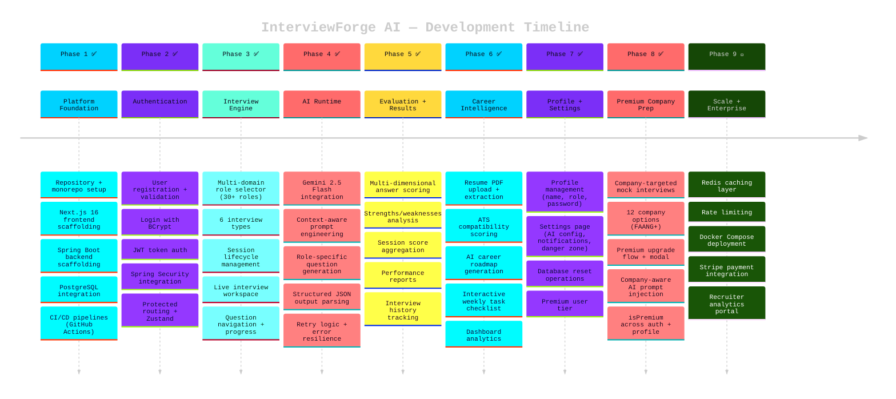

<br />

## 🔒 Security

<table>
<tr>
<td width="50%" valign="top">

### ✅ Implemented

- 🔐 BCrypt password hashing (adaptive cost factor)
- 🔑 JWT-based stateless authentication (HMAC-SHA256)
- 🛡️ Spring Security filter chain (custom JwtAuthenticationFilter)
- 🚪 Protected API routes + frontend `ProtectedRoute` guards
- 🧠 Server-side AI API key protection
- ✅ DTO validation (Jakarta Bean Validation + Zod)
- 🚨 Centralized GlobalExceptionHandler
- 🌐 CORS configuration with allowed origins
- 💎 Premium feature gating (server-validated)

</td>
<td width="50%" valign="top">

### 🔵 Planned

- ⏱️ Rate limiting & request throttling
- 💳 Stripe payment integration (real payments)
- 🔄 API key rotation strategy
- 📝 Security audit logging
- 🛡️ OWASP compliance hardening
- 🔒 Security headers (CSP, HSTS, etc.)
- 🧪 Penetration testing
- 📊 Anomaly detection

</td>
</tr>
</table>

<br />

## 🤝 Contributing

<details>
<summary><b>Contribution Workflow (click to expand)</b></summary>
<br />

```bash
# 1. Fork & clone
git clone https://github.com/YOUR_USERNAME/interviewforge-ai.git

# 2. Create feature branch
git checkout -b feature/amazing-feature

# 3. Make changes & validate
cd frontend && npx tsc --noEmit    # Frontend type-check
cd backend && mvn clean compile     # Backend compile

# 4. Commit with conventional commits
git commit -m "feat: add amazing feature"

# 5. Push & open PR
git push origin feature/amazing-feature
```

</details>

### 🌿 Git Conventions

| Prefix | Usage |
|:------:|-------|
| `feat:` | New feature |
| `fix:` | Bug fix |
| `refactor:` | Code restructuring |
| `docs:` | Documentation |
| `test:` | Tests |
| `chore:` | Maintenance |
| `perf:` | Performance |

<br />

## 📄 License

MIT — see [LICENSE](LICENSE) for details.

<br />

<!-- ═══════════════════════════ GRADIENT SEPARATOR ═══════════════════════════ -->


<br />

<div align="center">

## 👨‍💻 Author

### **Jawahar Bharathi**

**Full Stack Developer · AI Enthusiast · SaaS Builder**

Building production-grade applications across modern frontend systems,<br />
Java backend engineering, secure APIs, AI integration, and scalable SaaS.

<br />

<a href="https://github.com/Jawahar08"></a>

<br /><br />

<!-- ─────────── GITHUB STATS ─────────── -->


<br /><br />

<a href="#top"></a>

<br /><br />

<!-- ─────────── ANIMATED FOOTER WAVE ─────────── -->


</div>
