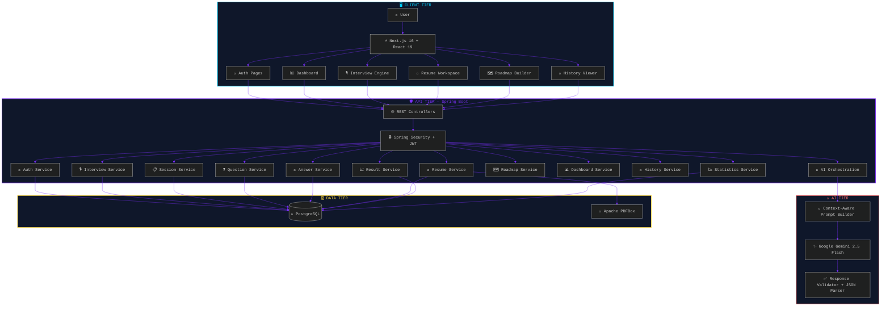
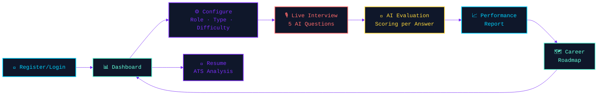
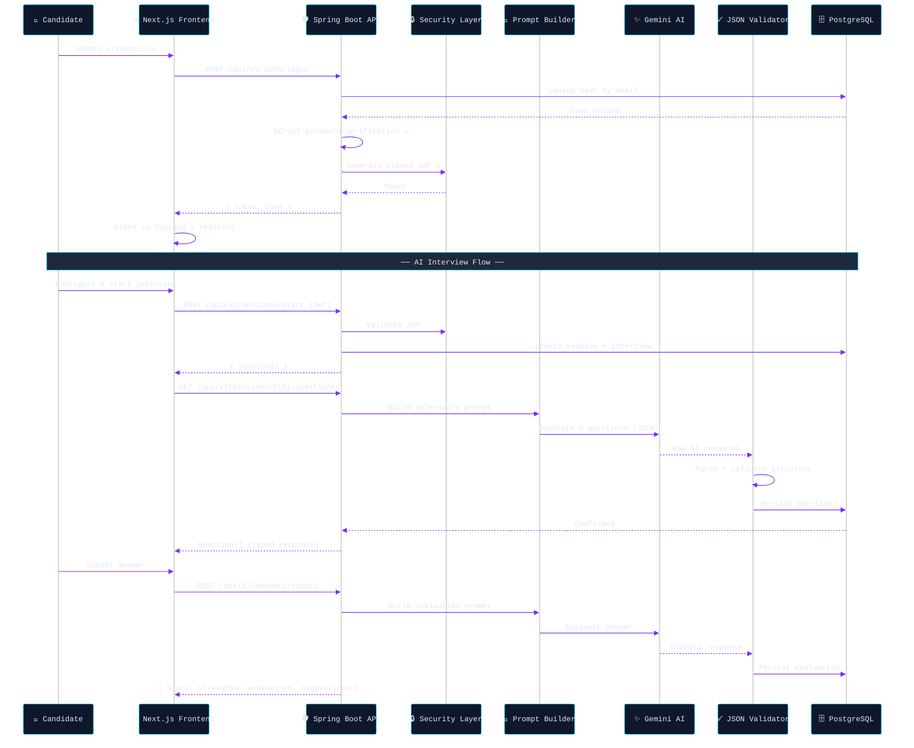
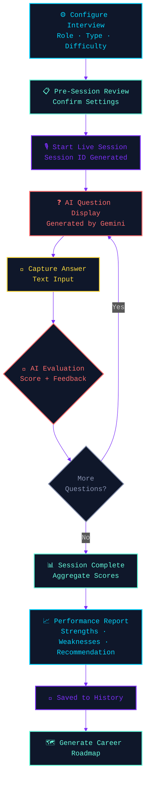
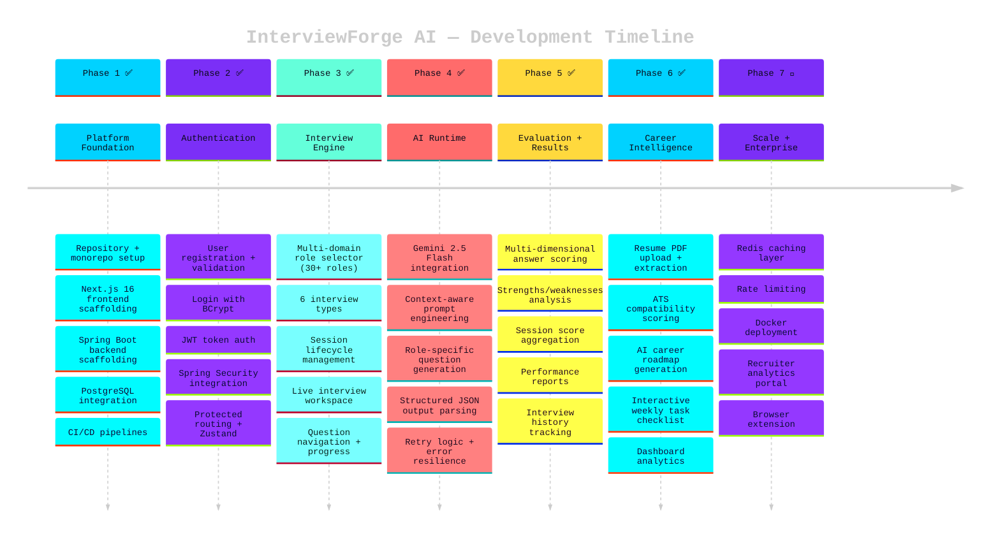

```mermaid
%%{init: {'theme': 'dark', 'themeVariables': { 'actorBkg': '#0f172a', 'actorBorder': '#00d2ff', 'actorTextColor': '#e2e8f0', 'signalColor': '#7b2ff7', 'signalTextColor': '#e2e8f0', 'fontFamily': 'JetBrains Mono, monospace'}}}%%

sequenceDiagram
    participant C as 👤 Candidate
    participant F as ⚡ Next.js
    participant B as 🛡️ Spring Boot
    participant S as 🔒 Spring Security
    participant D as 🗄️ PostgreSQL

    rect rgb(15, 23, 42)
        Note over C,D: Registration Flow
        C->>F: Fill registration form
        F->>F: Zod schema validation
        F->>B: POST /api/v1/auth/register
        B->>B: Validate DTO
        B->>B: Hash password (BCrypt)
        B->>D: INSERT user
        D-->>B: Created
        B-->>F: { token, user }
        F->>F: Zustand auth store update
        F->>F: Redirect → /dashboard
    end

    rect rgb(15, 23, 42)
        Note over C,D: Login Flow
        C->>F: Submit credentials
        F->>B: POST /api/v1/auth/login
        B->>D: SELECT user by email
        D-->>B: User record
        B->>B: BCrypt.matches() ✅
        B->>S: Generate JWT (HMAC-SHA256)
        S-->>B: Signed token
        B-->>F: { token, user }
        F->>F: Update Zustand + redirect
    end

    rect rgb(15, 23, 42)
        Note over C,D: Authenticated Requests
        C->>F: Navigate to protected page
        F->>F: ProtectedRoute guard check
        F->>B: GET /api/v1/dashboard (Authorization: Bearer ...)
        B->>S: JwtAuthenticationFilter
        S->>S: Validate signature + expiry
        S-->>B: SecurityContext populated
        B->>D: Query user data
        D-->>B: Results
        B-->>F: Typed API response
    end
```

<!-- ╔══════════════════════════════════════════════════════════════════╗ -->
<!-- ║               🔥 INTERVIEWFORGE AI — README                    ║ -->
<!-- ╚══════════════════════════════════════════════════════════════════╝ -->

<a name="top"></a>

<div align="center">

<!-- ─────────── ANIMATED WAVE HEADER ─────────── -->


<!-- ─────────── ANIMATED TYPING TERMINAL ─────────── -->

<a href="https://git.io/typing-svg"></a>

<br />

<!-- ─────────── TECH STACK ICONS STRIP ─────────── -->

<p>
  
</p>

<br />

<!-- ─────────── STATUS BADGES ─────────── -->

[](https://github.com/Jawahar08/interviewforge-ai/actions/workflows/frontend-ci.yml)
[](https://github.com/Jawahar08/interviewforge-ai/actions/workflows/backend-ci.yml)


<br />

<!-- ─────────── ONE-LINER ─────────── -->

> **InterviewForge AI** is a production-grade, full-stack platform that simulates realistic AI-powered interviews across **30+ career domains**, evaluates answers with multi-dimensional scoring, provides ATS resume intelligence, and generates personalized career roadmaps — all driven by **Google Gemini AI**.

<br />

<!-- ─────────── NAVIGATION PILLS ─────────── -->

<a href="#-demo"></a>
<a href="#-features-at-a-glance"></a>
<a href="#%EF%B8%8F-system-architecture"></a>
<a href="#-tech-stack"></a>
<a href="#-quick-start"></a>
<a href="#-api-reference"></a>

</div>

<br />

<!-- ═══════════════════════════ GRADIENT SEPARATOR ═══════════════════════════ -->


<br />

<!-- ╔══════════════════════════════════════════════════════════════════╗ -->
<!-- ║                       🎬 DEMO                                  ║ -->
<!-- ╚══════════════════════════════════════════════════════════════════╝ -->

## 🎬 Demo

<div align="center">

<!-- 
  ┌─────────────────────────────────────────────────────────────────────┐
  │  📹 REPLACE THE URL BELOW WITH YOUR ACTUAL DEMO VIDEO LINK        │
  │  Upload your video to GitHub (drag into issue/PR), YouTube,       │
  │  or use a .mp4 file in your repo.                                  │
  │                                                                     │
  │  Example formats that auto-play in GitHub README:                  │
  │  • GitHub user-content URL from drag-and-drop upload               │
  │  • Direct .mp4 link hosted anywhere                                │
  └─────────────────────────────────────────────────────────────────────┘
-->

https://github.com/user-attachments/assets/YOUR_DEMO_VIDEO_ID_HERE

> **⬆️ To add your demo video:** Go to any GitHub Issue → drag & drop your `.mp4` video → copy the generated `https://github.com/user-attachments/assets/...` URL → paste it above, replacing the placeholder.

</div>

<br />

<!-- ═══════════════════════════ GRADIENT SEPARATOR ═══════════════════════════ -->


<br />

<!-- ╔══════════════════════════════════════════════════════════════════╗ -->
<!-- ║                    THE PROBLEM & SOLUTION                       ║ -->
<!-- ╚══════════════════════════════════════════════════════════════════╝ -->

## 💡 Why InterviewForge AI?

<table>
<tr>
<td width="50%">

### ❌ Traditional Interview Prep

```diff
- 😰 Generic question lists with zero personalization
- 📝 No measurable, structured feedback on answers
- 🔄 Zero improvement tracking across sessions
- 📉 No weakness detection or skill-gap analysis
- 🤷 No personalized roadmap or career guidance
- 🧠 No AI — just memorization
```

</td>
<td width="50%">

### ✅ InterviewForge AI

```diff
+ 🧠 AI-generated questions tailored to YOUR role & domain
+ 📊 Multi-dimensional scoring (technical, clarity, depth)
+ 📈 Historical performance analytics & trend tracking
+ 🎯 Weakness-to-strength detection pipeline
+ 🗺️ AI-powered personalized career roadmap
+ 📄 ATS resume intelligence with skill-gap analysis
```

</td>
</tr>
</table>

<br />

<!-- ╔══════════════════════════════════════════════════════════════════╗ -->
<!-- ║                    FEATURES AT A GLANCE                         ║ -->
<!-- ╚══════════════════════════════════════════════════════════════════╝ -->

## ✨ Features at a Glance

<div align="center">

```
╔══════════════════╦══════════════════╦══════════════════╦══════════════════╗
║   🔐 Secure      ║   🎙️ Interview   ║   🧠 AI Engine   ║   📄 Resume      ║
║   Auth System    ║   Simulator      ║   (Gemini)       ║   Intelligence   ║
╠══════════════════╬══════════════════╬══════════════════╬══════════════════╣
║   📊 Dashboard   ║   📜 Session      ║   🗺️ Career     ║   👤 Profile     ║
║   Analytics      ║   History        ║   Roadmap        ║   Manager        ║
╚══════════════════╩══════════════════╩══════════════════╩══════════════════╝
```

</div>

<table>
<tr>
<td width="50%" valign="top">

### 🔐 Authentication & Security
> Production-grade auth with zero compromises

- ✅ User registration with full validation
- ✅ Login with BCrypt password verification
- ✅ Stateless JWT token authentication
- ✅ Spring Security filter chain
- ✅ Protected API routes + frontend guards
- ✅ Centralized auth state via Zustand
- ✅ Server-side API key protection

</td>
<td width="50%" valign="top">

### 🎙️ AI Interview Simulator
> Realistic mock interviews across 30+ roles

- ✅ **6 domain categories** with 30+ target roles
- ✅ **Custom role input** — type ANY job title
- ✅ 6 interview types (Technical, Behavioral, Case Study, etc.)
- ✅ 3 difficulty levels (Easy → Medium → Hard)
- ✅ Live interview workspace with progress tracking
- ✅ Real-time question navigation & answer capture
- ✅ Pre-session review & configuration

</td>
</tr>
<tr>
<td width="50%" valign="top">

### 🧠 AI Evaluation Pipeline
> Multi-dimensional answer analysis powered by Gemini

- ✅ Real-time answer scoring (0–10 scale)
- ✅ Strengths & weaknesses breakdown per answer
- ✅ Improvement suggestions with actionable feedback
- ✅ Technical correctness verification
- ✅ Relevance, clarity & completeness detection
- ✅ Communication quality assessment
- ✅ Overall session score aggregation

</td>
<td width="50%" valign="top">

### 📄 Resume Intelligence (ATS)
> Transform your PDF into career insights

- ✅ PDF upload & text extraction
- ✅ AI-powered ATS compatibility scoring (0–100)
- ✅ Technical skill identification
- ✅ Experience analysis & strength evaluation
- ✅ Missing skill detection
- ✅ Role compatibility scoring
- ✅ Actionable improvement recommendations

</td>
</tr>
<tr>
<td width="50%" valign="top">

### 🗺️ AI Career Roadmap
> Personalized learning timeline with task tracking

- ✅ AI-generated weekly study plans
- ✅ Interactive task checklist with progress tracking
- ✅ Capstone project recommendations
- ✅ Curated learning resources & links
- ✅ Readiness score gauge
- ✅ Estimated preparation duration
- ✅ Reset & regenerate capability

</td>
<td width="50%" valign="top">

### 📊 Dashboard & Analytics
> Data-driven interview intelligence

- ✅ Overall performance metrics dashboard
- ✅ Average / best / lowest score tracking
- ✅ Total interviews, questions & answers counters
- ✅ Historical interview results timeline
- ✅ Resume upload history
- ✅ Quick-action navigation cards
- ✅ Responsive glassmorphism UI

</td>
</tr>
</table>

<br />

### 🌍 Supported Career Domains & Roles

<div align="center">

| Domain | Available Roles |
|:------:|:----------------|
| 💻 **Tech & CS** | Full Stack Developer · Backend Developer · Frontend Developer · Software Engineer · DevOps Engineer · Data Scientist · Cybersecurity Analyst |
| 💼 **Business** | Product Manager · Project Manager · Business Analyst · Management Consultant |
| 🧠 **Psychology & HR** | Clinical Psychologist · HR Manager · UX Researcher · Career Counselor |
| 🏥 **Healthcare & Science** | Medical Doctor · Registered Nurse · Physiotherapist · Research Scientist |
| 💰 **Finance & Marketing** | Financial Analyst · Marketing Manager · Accountant · Sales Representative |
| 📚 **Education & Writing** | Teacher · Content Writer · Social Worker |
| ✏️ **Custom / Other** | _Type any role you want — Chef, Pilot, Civil Engineer, Architect, etc._ |

</div>

<br />

### 🎭 Interview Types

<div align="center">

| Type | Focus Area |
|:----:|:-----------|
| 🔬 **Technical / Domain-Specific** | Core knowledge, tools, concepts, technical problem-solving |
| 🎭 **Behavioral / Situational** | STAR responses, leadership, teamwork, conflict resolution |
| 📋 **Case Study & Analysis** | Real-world scenario analysis, structured thinking |
| ⚡ **Stress & Ethical Scenario** | Pressure handling, ethical decision-making |
| 🏗️ **System & Process Design** | Architecture, workflow design, scalability thinking |
| 🔀 **Mixed** | Comprehensive blend of all interview styles |

</div>

<br />

<!-- ═══════════════════════════ GRADIENT SEPARATOR ═══════════════════════════ -->


<br />

<!-- ╔══════════════════════════════════════════════════════════════════╗ -->
<!-- ║                    SYSTEM ARCHITECTURE                           ║ -->
<!-- ╚══════════════════════════════════════════════════════════════════╝ -->

## 🏗️ System Architecture

### High-Level Overview



<br />

### 🔄 Core Product Flow



<br />

<details>
<summary><b>🔍 Request Lifecycle — Sequence Diagram (click to expand)</b></summary>
<br />



</details>

<br />

<details>
<summary><b>🔐 Authentication Flow — Detailed (click to expand)</b></summary>
<br />



</details>

<br />

<details>
<summary><b>🎙️ Interview Engine — Lifecycle (click to expand)</b></summary>
<br />



</details>

<br />

<!-- ═══════════════════════════ GRADIENT SEPARATOR ═══════════════════════════ -->


<br />

<!-- ╔══════════════════════════════════════════════════════════════════╗ -->
<!-- ║                       TECH STACK                                ║ -->
<!-- ╚══════════════════════════════════════════════════════════════════╝ -->

## 🛠️ Tech Stack

<div align="center">

```
    ┌─────────────────────────────────────────────────────────────────┐
    │                    INTERVIEWFORGE AI STACK                       │
    │                                                                 │
    │  ┌─────────────┐  ┌─────────────┐  ┌──────────────────────┐   │
    │  │  FRONTEND   │  │   BACKEND   │  │     INTELLIGENCE     │   │
    │  │             │  │             │  │                      │   │
    │  │ Next.js 16  │  │ Spring Boot │  │  Google Gemini 2.5   │   │
    │  │ React 19    │  │ Java 17+    │  │  Flash API           │   │
    │  │ TypeScript 5│  │ Hibernate   │  │                      │   │
    │  │ Tailwind CSS│  │ Spring Sec  │  │  Apache PDFBox       │   │
    │  │ Zustand     │  │ JWT Auth    │  │  (Resume Parsing)    │   │
    │  │ Axios       │  │ Swagger/OAS │  │                      │   │
    │  │ Lucide Icons│  │ Maven       │  │                      │   │
    │  └──────┬──────┘  └──────┬──────┘  └───────────┬──────────┘   │
    │         │                │                     │               │
    │         └───────┬────────┴─────────────────────┘               │
    │                 │                                               │
    │          ┌──────┴──────┐                                       │
    │          │  PostgreSQL │                                       │
    │          │  Database   │                                       │
    │          └─────────────┘                                       │
    └─────────────────────────────────────────────────────────────────┘
```

</div>

<details open>
<summary><b>🖥️ Frontend</b></summary>
<br />

| Technology | Role | Version |
|:----------:|------|:-------:|
|  **Next.js** | App Router framework & SSR | `16` |
|  **React** | Component architecture | `19` |
|  **TypeScript** | End-to-end type safety | `5` |
|  **Tailwind CSS** | Utility-first responsive styling | `latest` |
| 🐻 **Zustand** | Lightweight client state management | `latest` |
| 📡 **Axios** | Typed HTTP client with interceptors | `latest` |
| ✨ **Lucide React** | Beautiful icon library | `latest` |

</details>

<details open>
<summary><b>⚙️ Backend</b></summary>
<br />

| Technology | Role | Version |
|:----------:|------|:-------:|
|  **Java** | Core language | `17+` |
|  **Spring Boot** | REST API framework | `latest` |
| 🛡️ **Spring Security** | Authentication & authorization | `—` |
| 🔑 **JWT (JJWT)** | Stateless token authentication | `—` |
| 🔐 **BCrypt** | Password hashing | `—` |
|  **Hibernate/JPA** | ORM & database abstraction | `—` |
|  **Maven** | Dependency management & build | `—` |
| 📄 **SpringDoc OpenAPI** | Auto-generated Swagger docs | `—` |

</details>

<details open>
<summary><b>🗄️ Data & AI</b></summary>
<br />

| Technology | Role |
|:----------:|------|
|  **PostgreSQL** | Primary relational database |
| ✨ **Google Gemini 2.5 Flash** | AI question generation, answer evaluation, resume analysis, roadmap generation |
| 📑 **Apache PDFBox** | PDF text extraction for resume analysis |
|  **Docker** | Containerization (planned) |
|  **GitHub Actions** | CI/CD pipelines |

</details>

<br />

<!-- ═══════════════════════════ GRADIENT SEPARATOR ═══════════════════════════ -->


<br />

<!-- ╔══════════════════════════════════════════════════════════════════╗ -->
<!-- ║                    PROJECT STRUCTURE                             ║ -->
<!-- ╚══════════════════════════════════════════════════════════════════╝ -->

## 📁 Project Structure

<details>
<summary><b>🖥️ Frontend — Feature-Sliced Architecture (click to expand)</b></summary>

```
frontend/
├── 📂 app/                          # Next.js App Router
│   ├── 🏠 page.tsx                  # Landing page (public)
│   ├── 🎨 globals.css               # Global styles
│   ├── 📐 layout.tsx                # Root layout
│   │
│   ├── 🔐 auth/
│   │   ├── login/page.tsx           # Login page
│   │   └── register/page.tsx        # Registration page
│   │
│   ├── 📊 (protected)/              # Auth-guarded layout group
│   │   ├── layout.tsx               # Sidebar + header layout
│   │   ├── dashboard/page.tsx       # Analytics dashboard
│   │   └── history/page.tsx         # Interview history
│   │
│   ├── 🎙️ interview/
│   │   ├── page.tsx                 # Interview setup (role/type/difficulty)
│   │   └── session/[sessionId]/
│   │       ├── page.tsx             # Pre-session review
│   │       ├── live/page.tsx        # Live interview workspace
│   │       └── result/page.tsx      # Performance report
│   │
│   ├── 📄 resume/page.tsx           # Resume upload & ATS analysis
│   ├── 🗺️ roadmap/page.tsx         # AI career roadmap builder
│   ├── 👤 profile/page.tsx          # User profile
│   └── ⚙️ settings/page.tsx        # App settings
│
├── 📂 features/                     # Feature-sliced modules
│   ├── 🔐 auth/                     # Auth hooks, API, store, types
│   ├── 📊 dashboard/                # Dashboard API, hooks, types
│   ├── 📜 history/                  # History API, components, types
│   ├── 🎙️ interview/               # Interview API, components, schemas, store, types
│   ├── 👤 profile/                  # Profile components
│   ├── 📈 result/                   # Result API, components, types
│   ├── 📄 resume/                   # Resume API, hooks, types
│   └── 🗺️ roadmap/                 # Roadmap API, components, types
│
├── 📂 shared/                       # Shared/reusable code
│   ├── components/                  # Auth guards, sidebar, header, UI
│   ├── store/                       # Global Zustand stores
│   └── utilities/                   # Helper functions
│
└── 📂 lib/
    └── api/client.ts                # Axios instance with JWT interceptor
```

</details>

<details>
<summary><b>⚙️ Backend — Domain-Driven Architecture (click to expand)</b></summary>

```
backend/src/main/java/com/interviewforge/
│
├── 🚀 BackendApplication.java       # Spring Boot entry point
│
├── 🔐 auth/                         # Authentication domain
│   ├── controller/                  # AuthController (login, register)
│   ├── dto/                         # LoginRequest, RegisterRequest, AuthResponse
│   └── service/                     # AuthService (BCrypt, JWT generation)
│
├── 🛡️ security/                     # Security configuration
│   ├── SecurityConfig.java          # Filter chain, CORS, route rules
│   ├── JwtAuthenticationFilter.java # Token extraction + validation
│   └── JwtTokenProvider.java        # JWT sign/verify utilities
│
├── 🎙️ interview/                    # Interview domain
│   ├── controller/                  # InterviewController
│   ├── entity/                      # Interview JPA entity
│   ├── repository/                  # InterviewRepository
│   └── service/                     # InterviewService
│
├── 📋 session/                       # Session management domain
│   ├── controller/                  # InterviewSessionController
│   ├── entity/                      # InterviewSession entity
│   ├── repository/                  # InterviewSessionRepository
│   └── service/                     # InterviewSessionService
│
├── ❓ question/                      # Question domain
│   ├── entity/                      # Question entity
│   └── repository/                  # QuestionRepository
│
├── 💬 answer/                        # Answer domain
│   ├── controller/                  # AnswerController (submit + evaluate)
│   ├── dto/                         # AnswerSubmitRequest, EvaluationResponse
│   ├── entity/                      # Answer entity
│   ├── repository/                  # AnswerRepository
│   └── service/                     # AnswerService
│
├── 🧠 ai/                           # AI orchestration layer
│   ├── gemini/                      # GeminiService (API integration + mock handler)
│   └── service/                     # AIQuestionService (prompt builder)
│
├── 📄 resume/                        # Resume intelligence domain
│   ├── controller/                  # ResumeController (upload + analyze)
│   ├── entity/                      # Resume entity
│   ├── repository/                  # ResumeRepository
│   └── service/                     # ResumeService (PDF extraction + AI analysis)
│
├── 🗺️ roadmap/                      # Learning roadmap domain
│   ├── controller/                  # LearningRoadmapController
│   ├── dto/                         # Request, Response, WeekPlan, ProjectDto, ResourceDto
│   └── service/                     # LearningRoadmapService
│
├── 📈 result/                        # Interview result domain
│   ├── controller/                  # ResultController
│   ├── dto/                         # ResultResponse, QuestionReviewDto
│   ├── entity/                      # InterviewResult entity
│   ├── repository/                  # InterviewResultRepository
│   └── service/                     # ResultService
│
├── 📊 dashboard/                     # Dashboard analytics
│   ├── controller/                  # DashboardController
│   ├── dto/                         # DashboardResponse
│   └── service/                     # DashboardService
│
├── 📜 history/                       # Interview history domain
├── 📉 statistics/                    # Statistics aggregation
├── 👤 profile/                       # User profile domain
├── 💼 company/                       # Company domain
├── 🎯 jobmatch/                      # Job matching domain
├── 📋 recommendation/                # AI recommendations
├── 📊 report/                        # Report generation
├── 🎭 mockinterview/                 # Mock interview utilities
│
├── ⚙️ config/                        # App configuration (CORS, RestTemplate, etc.)
├── 🔧 common/                        # Shared DTOs, ApiResponse, GlobalExceptionHandler
├── 🚨 exception/                     # Custom exceptions
├── 🏥 health/                        # Health check endpoints
└── 🌐 controller/                    # Shared controllers
```

</details>

<br />

<!-- ═══════════════════════════ GRADIENT SEPARATOR ═══════════════════════════ -->


<br />

<!-- ╔══════════════════════════════════════════════════════════════════╗ -->
<!-- ║                       API REFERENCE                             ║ -->
<!-- ╚══════════════════════════════════════════════════════════════════╝ -->

## 📡 API Reference

<div align="center">

Base URL: `http://localhost:8080/api/v1` &nbsp;·&nbsp; Swagger: `http://localhost:8080/swagger-ui/index.html`

</div>

<br />

<details>
<summary><b>🔐 Authentication</b></summary>

| Method | Endpoint | Description | Auth |
|:------:|----------|-------------|:----:|
| `POST` | `/auth/register` | Create new user account | ❌ |
| `POST` | `/auth/login` | Authenticate & receive JWT | ❌ |

**Register Request:**
```json
{
  "name": "Jane Doe",
  "email": "jane@example.com",
  "password": "SecureP@ssw0rd"
}
```

**Login Response:**
```json
{
  "success": true,
  "message": "Authentication successful",
  "data": {
    "token": "eyJhbGciOiJIUzI1NiIs...",
    "user": { "id": 1, "name": "Jane Doe", "email": "jane@example.com" }
  }
}
```

</details>

<details>
<summary><b>🎙️ Interviews & Sessions</b></summary>

| Method | Endpoint | Description | Auth |
|:------:|----------|-------------|:----:|
| `POST` | `/interviews` | Create interview config | 🔐 |
| `GET` | `/interviews` | List user interviews | 🔐 |
| `GET` | `/interviews/{id}` | Get interview details | 🔐 |
| `POST` | `/sessions/start` | Start new session | 🔐 |
| `GET` | `/sessions/{sessionId}` | Get session state | 🔐 |
| `GET` | `/sessions/{sessionId}/questions` | Get AI-generated questions | 🔐 |

</details>

<details>
<summary><b>💬 Answers & Evaluation</b></summary>

| Method | Endpoint | Description | Auth |
|:------:|----------|-------------|:----:|
| `POST` | `/answers/submit` | Submit answer for AI evaluation | 🔐 |

**Submit Answer Request:**
```json
{
  "sessionId": 1,
  "questionId": 5,
  "answerText": "My approach to system design starts with..."
}
```

**AI Evaluation Response:**
```json
{
  "success": true,
  "data": {
    "score": 8,
    "evaluation": "Score: 8/10\nStrengths: ...\nWeaknesses: ...\nSuggestions: ..."
  }
}
```

</details>

<details>
<summary><b>📄 Resume Intelligence</b></summary>

| Method | Endpoint | Description | Auth |
|:------:|----------|-------------|:----:|
| `POST` | `/resume/upload` | Upload PDF resume | 🔐 |
| `GET` | `/resume` | Get user resume list | 🔐 |
| `GET` | `/resume/{id}` | Get resume analysis | 🔐 |

</details>

<details>
<summary><b>🗺️ Career Roadmap</b></summary>

| Method | Endpoint | Description | Auth |
|:------:|----------|-------------|:----:|
| `POST` | `/roadmap/generate` | Generate AI learning roadmap | 🔐 |

**Roadmap Request:**
```json
{
  "targetRole": "Full Stack Developer",
  "experience": "Mid Level",
  "resumeText": "3 years experience with React, Node.js..."
}
```

</details>

<details>
<summary><b>📊 Dashboard, History & Results</b></summary>

| Method | Endpoint | Description | Auth |
|:------:|----------|-------------|:----:|
| `GET` | `/dashboard` | Get analytics overview | 🔐 |
| `GET` | `/history` | Get interview history | 🔐 |
| `GET` | `/results/{sessionId}` | Get session result | 🔐 |

</details>

<br />

### 📦 Standard Response Envelope

```json
{
  "success": true,
  "message": "Operation completed successfully",
  "data": { }
}
```

<br />

<!-- ═══════════════════════════ GRADIENT SEPARATOR ═══════════════════════════ -->


<br />

<!-- ╔══════════════════════════════════════════════════════════════════╗ -->
<!-- ║                       QUICK START                               ║ -->
<!-- ╚══════════════════════════════════════════════════════════════════╝ -->

## 🚀 Quick Start

### Prerequisites

```
Node.js 18+  ·  Java 17+  ·  Maven  ·  PostgreSQL  ·  Git
```

### 1️⃣ Clone & Configure

```bash
# Clone the repository
git clone https://github.com/Jawahar08/interviewforge-ai.git
cd interviewforge-ai

# Set environment variables
export DB_URL=jdbc:postgresql://localhost:5432/interviewforge
export DB_USERNAME=postgres
export DB_PASSWORD=your_password
export JWT_SECRET=your_secure_jwt_secret_at_least_32_chars
export GEMINI_API_KEY=your_gemini_api_key  # or "mock-dev-key" for local dev
```

### 2️⃣ Start Backend

```bash
cd backend
mvn clean compile
mvn spring-boot:run
# 🟢 API → http://localhost:8080
# 📄 Swagger → http://localhost:8080/swagger-ui/index.html
```

### 3️⃣ Start Frontend

```bash
cd frontend
npm install
npm run dev
# 🟢 App → http://localhost:3000
```

### 4️⃣ Validate

```bash
# Frontend type-check
cd frontend && npx tsc --noEmit

# Backend compile check
cd backend && mvn clean compile
```

> 💡 **Local Dev Tip:** Set `GEMINI_API_KEY=mock-dev-key` to run the full platform locally without a real Gemini API key. The backend will serve realistic mock responses for all AI features.

<br />

<!-- ═══════════════════════════ GRADIENT SEPARATOR ═══════════════════════════ -->


<br />

<!-- ╔══════════════════════════════════════════════════════════════════╗ -->
<!-- ║                       DEVELOPMENT ROADMAP                       ║ -->
<!-- ╚══════════════════════════════════════════════════════════════════╝ -->

## 🗺️ Development Roadmap



<br />

<!-- ╔══════════════════════════════════════════════════════════════════╗ -->
<!-- ║                       SECURITY                                  ║ -->
<!-- ╚══════════════════════════════════════════════════════════════════╝ -->

## 🔒 Security

<table>
<tr>
<td width="50%" valign="top">

### ✅ Implemented

- 🔐 BCrypt password hashing (adaptive cost factor)
- 🔑 JWT-based stateless authentication
- 🛡️ Spring Security filter chain
- 🚪 Protected API routes + frontend guards
- 🧠 Server-side AI API key protection
- ✅ DTO validation (Jakarta Bean Validation)
- 🚨 Centralized exception handling
- 🌐 CORS configuration

</td>
<td width="50%" valign="top">

### 🔵 Planned

- ⏱️ Rate limiting & request throttling
- 🔄 API key rotation strategy
- 📝 Security audit logging
- 🛡️ OWASP compliance hardening
- 🔒 Security headers (CSP, HSTS, etc.)
- 🧪 Penetration testing
- 📊 Anomaly detection

</td>
</tr>
</table>

<br />

<!-- ╔══════════════════════════════════════════════════════════════════╗ -->
<!-- ║                       CONTRIBUTING                               ║ -->
<!-- ╚══════════════════════════════════════════════════════════════════╝ -->

## 🤝 Contributing

<details>
<summary><b>Contribution Workflow (click to expand)</b></summary>
<br />

```bash
# 1. Fork & clone
git clone https://github.com/YOUR_USERNAME/interviewforge-ai.git

# 2. Create feature branch
git checkout -b feature/amazing-feature

# 3. Make changes & validate
cd frontend && npx tsc --noEmit    # Frontend type-check
cd backend && mvn clean compile     # Backend compile

# 4. Commit with conventional commits
git commit -m "feat: add amazing feature"

# 5. Push & open PR
git push origin feature/amazing-feature
```

</details>

<br />

### 🌿 Git Conventions

| Prefix | Usage |
|:------:|-------|
| `feat:` | New feature |
| `fix:` | Bug fix |
| `refactor:` | Code restructuring |
| `docs:` | Documentation |
| `test:` | Tests |
| `chore:` | Maintenance |
| `perf:` | Performance |

<br />

<!-- ═══════════════════════════ GRADIENT SEPARATOR ═══════════════════════════ -->


<br />

<!-- ╔══════════════════════════════════════════════════════════════════╗ -->
<!-- ║                       AUTHOR & FOOTER                           ║ -->
<!-- ╚══════════════════════════════════════════════════════════════════╝ -->

<div align="center">

<br />

## 👨‍💻 Author

### **Jawahar Bharathi**

**Full Stack Developer · AI Enthusiast · SaaS Builder**

Building production-grade applications across modern frontend systems,<br />
Java backend engineering, secure APIs, AI integration, and scalable SaaS.

<br />

<a href="https://github.com/Jawahar08"></a>

<br /><br />

<!-- ─────────── GITHUB STATS ─────────── -->


<br /><br />

<a href="#top"></a>

<br /><br />

<!-- ─────────── ANIMATED FOOTER WAVE ─────────── -->


</div>
