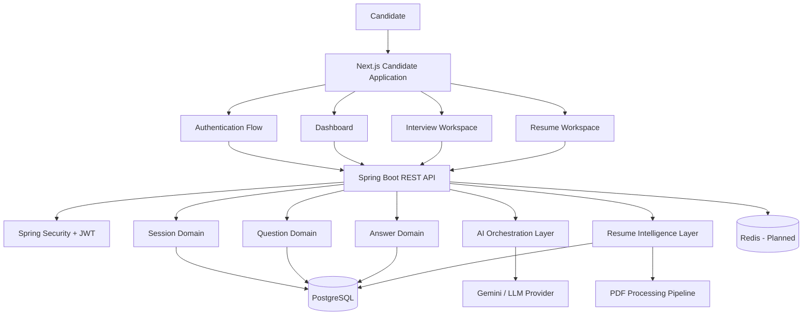
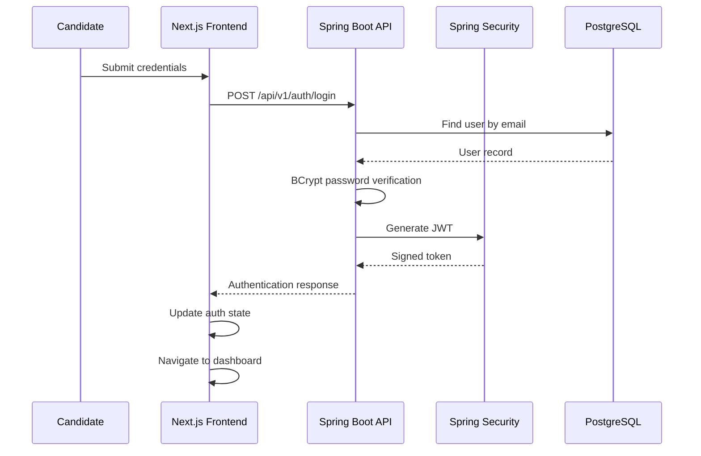
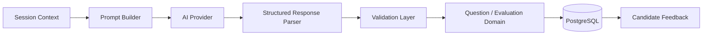

<div align="center">

# 🚀 InterviewForge AI

### AI-Powered Interview Preparation, Evaluation & Career Intelligence Platform

**Practice realistically. Analyze deeply. Improve continuously. Get hired.**

[](https://github.com/Jawahar08/interviewforge-ai/actions/workflows/frontend-ci.yml)
[](https://github.com/Jawahar08/interviewforge-ai/actions/workflows/backend-ci.yml)


<br />

> **InterviewForge AI is a production-oriented full-stack platform designed to simulate realistic interviews, manage authenticated interview sessions, evaluate candidate performance, analyze resumes, and generate personalized career improvement insights.**

</div>

---

## 📌 Overview

Traditional interview preparation is often static:

- candidates memorize generic questions,
- practice without measurable feedback,
- receive little insight into weak areas,
- and struggle to track improvement over time.

**InterviewForge AI** is being built to solve that problem through a structured, data-driven interview preparation workflow.

The platform combines:

- secure authentication,
- configurable interview sessions,
- live interview workflows,
- AI-assisted question generation,
- answer evaluation,
- resume intelligence,
- performance analytics,
- interview history,
- and personalized improvement roadmaps.

The objective is not simply to generate interview questions.

The objective is to build a complete **Interview Intelligence Platform**.

---

## 🎯 Core Product Flow

```text
Candidate
   │
   ▼
Register / Login
   │
   ▼
Authenticated Dashboard
   │
   ├── Resume Intelligence
   ├── Interview History
   ├── Performance Analytics
   └── Personalized Roadmap
   │
   ▼
Configure Interview
   │
   ├── Target Role
   ├── Interview Type
   ├── Difficulty
   └── Duration
   │
   ▼
Create Interview Session
   │
   ▼
Pre-Interview Session Review
   │
   ▼
Live Interview Workspace
   │
   ├── Question Progress
   ├── Answer Capture
   ├── Session State
   └── Interview Controls
   │
   ▼
AI Evaluation Pipeline
   │
   ├── Relevance
   ├── Technical Depth
   ├── Clarity
   ├── Communication
   └── Improvement Areas
   │
   ▼
Final Performance Report
   │
   ▼
History + Analytics + Roadmap
```

---

# 🏗️ System Architecture

InterviewForge AI follows a **modular full-stack architecture** with clear separation between presentation, application, domain, persistence, security, and AI orchestration concerns.



---

## 🧱 Architectural Principles

The project is designed around several engineering principles:

### 1. Separation of Concerns

Frontend rendering, authentication, interview state, persistence, and AI orchestration are treated as independent responsibilities.

### 2. Backend-Owned AI Orchestration

AI providers are never called directly from the browser.

```text
Frontend
   ↓
Spring Boot API
   ↓
Prompt Construction
   ↓
AI Provider
   ↓
Response Validation
   ↓
Persistence
   ↓
Frontend Response
```

This protects API keys and enables:

- centralized prompt management,
- provider abstraction,
- retry strategies,
- validation,
- rate limiting,
- observability,
- and future model switching.

### 3. Domain-Oriented Backend Structure

Backend modules are organized around business capabilities instead of placing the entire application inside generic controller and service folders.

### 4. Secure Authentication Boundaries

The backend owns authentication and authorization decisions. Protected resources are designed to derive identity from validated JWT authentication rather than trusting browser-supplied user identifiers.

### 5. Incremental Production Architecture

The platform is being developed in phases, with each workflow validated before additional AI and analytics capabilities are layered on top.

---

# 🖥️ Frontend Architecture

The candidate application is built with a modern Next.js architecture.

```text
frontend/
├── app/
│   ├── auth/
│   │   ├── login/
│   │   └── register/
│   │
│   ├── dashboard/
│   ├── history/
│   ├── interview/
│   │   └── session/
│   │       └── [sessionId]/
│   │           ├── page.tsx
│   │           └── live/
│   │               └── page.tsx
│   │
│   ├── profile/
│   ├── resume/
│   ├── roadmap/
│   └── settings/
│
├── features/
│   ├── auth/
│   └── interview/
│       ├── api/
│       ├── components/
│       ├── store/
│       └── types/
│
├── shared/
│   ├── components/
│   ├── store/
│   └── utilities/
│
└── lib/
    └── api/
```

### Frontend Responsibilities

- authentication UI,
- protected application navigation,
- interview configuration,
- dynamic session routing,
- live interview workspace,
- typed API communication,
- client-side session state,
- loading and error states,
- responsive design,
- reusable UI composition.

---

# ⚙️ Backend Architecture

The backend is implemented using Java and Spring Boot.

```text
backend/
└── src/main/java/com/interviewforge/
    ├── auth/
    ├── security/
    ├── interview/
    ├── session/
    ├── question/
    ├── answer/
    ├── ai/
    ├── dashboard/
    ├── common/
    └── configuration/
```

The backend follows a layered request lifecycle:

```text
HTTP Request
   ↓
Controller
   ↓
Validation
   ↓
Authentication / Authorization
   ↓
Service Layer
   ↓
Domain Logic
   ↓
Repository Layer
   ↓
PostgreSQL
   ↓
DTO Mapping
   ↓
Standardized API Response
```

---

# 🔐 Authentication Architecture

InterviewForge AI currently includes an end-to-end authentication flow.



### Implemented Security Capabilities

- user registration,
- user login,
- BCrypt password hashing,
- JWT generation,
- Spring Security integration,
- authentication filtering,
- protected API foundations,
- centralized authentication state,
- authenticated frontend routing.

---

# 🎙️ Interview Session Engine

The session workflow is one of the core platform capabilities.

```text
Interview Configuration
   ↓
Session Initialization
   ↓
Dynamic Session ID
   ↓
Session Review Screen
   ↓
Begin Interview
   ↓
Live Interview Runtime
   ↓
Question Progression
   ↓
Answer Submission
   ↓
Completion
   ↓
Evaluation Pipeline
```

### Current Live Workspace Capabilities

- dynamic session routing,
- unique session identifiers,
- pre-interview configuration review,
- live interview interface,
- current-question tracking,
- progress visualization,
- typed answer capture,
- question navigation,
- session controls,
- Zustand-based interview state foundation.

Example route:

```text
/interview/session/{sessionId}/live
```

---

# 🧠 AI Interview Engine

The AI layer is designed as a backend-controlled orchestration pipeline.



### Planned AI Evaluation Dimensions

Each candidate response can be evaluated across dimensions such as:

| Dimension | Purpose |
|---|---|
| Relevance | Measures alignment with the actual question |
| Technical Depth | Evaluates conceptual and implementation knowledge |
| Clarity | Measures structure and understandability |
| Accuracy | Detects incorrect or misleading claims |
| Communication | Evaluates explanation quality |
| Problem Solving | Measures reasoning and decision-making |
| Completeness | Identifies missing critical concepts |

---

# 📄 Resume Intelligence

The resume module is designed to transform uploaded resumes into structured career intelligence.

```text
PDF Upload
   ↓
Validation
   ↓
Text Extraction
   ↓
Content Normalization
   ↓
Skill Detection
   ↓
Experience Analysis
   ↓
AI Evaluation
   ↓
Structured Resume Report
```

### Target Capabilities

- PDF upload,
- resume text extraction,
- technical skill identification,
- experience analysis,
- project strength evaluation,
- missing-skill detection,
- role compatibility analysis,
- personalized improvement recommendations.

---

# 📊 Analytics & Career Intelligence

InterviewForge AI is designed to move beyond one-time mock interviews.

The analytics layer will aggregate historical performance into actionable insights.

### Planned Metrics

- total interviews completed,
- average interview score,
- strongest technical areas,
- recurring weaknesses,
- communication trends,
- role-specific readiness,
- difficulty progression,
- recent performance changes,
- recommended next actions.

---

# 🛠️ Technology Stack

## Frontend

| Technology | Responsibility |
|---|---|
| Next.js 16 | Application framework and routing |
| React 19 | Component architecture |
| TypeScript | Static type safety |
| Tailwind CSS | Responsive UI styling |
| Zustand | Client-side state management |
| Axios | Typed HTTP communication |
| Lucide React | Interface iconography |

## Backend

| Technology | Responsibility |
|---|---|
| Java | Core backend language |
| Spring Boot | REST application framework |
| Spring Security | Authentication and authorization |
| JWT | Stateless access authentication |
| BCrypt | Secure password hashing |
| Spring Data JPA | Persistence abstraction |
| Hibernate | ORM implementation |
| Jakarta Validation | Request validation |
| Maven | Build and dependency management |
| OpenAPI / Swagger | API documentation |

## Data & Infrastructure

| Technology | Responsibility |
|---|---|
| PostgreSQL | Primary relational database |
| Redis | Planned caching and ephemeral state |
| Docker | Containerized development |
| GitHub Actions | Continuous integration |
| Git | Source control |

## AI & Intelligence

| Technology | Responsibility |
|---|---|
| Gemini API | AI question generation and evaluation |
| Prompt Orchestration | Context-aware AI request construction |
| Structured AI Output | Machine-readable evaluation responses |
| PDF Processing | Resume extraction and analysis pipeline |

---

# ✨ Feature Status

> Status reflects the current implementation state of the repository rather than the final product vision.

| Module | Capability | Status |
|---|---|:---:|
| Authentication | Registration flow | ✅ Implemented |
| Authentication | Login flow | ✅ Implemented |
| Authentication | BCrypt password hashing | ✅ Implemented |
| Authentication | JWT generation | ✅ Implemented |
| Frontend | Landing experience | ✅ Implemented |
| Frontend | Auth pages | ✅ Implemented |
| Dashboard | Protected dashboard foundation | ✅ Implemented |
| Interview | Configuration workflow | ✅ Implemented |
| Interview | Dynamic session routing | ✅ Implemented |
| Interview | Pre-session review | ✅ Implemented |
| Interview | Live interview workspace | ✅ Implemented |
| Interview | Client session state | 🟡 In Progress |
| AI Engine | Dynamic question generation | 🟡 In Progress |
| Evaluation | AI answer scoring | 🟡 In Progress |
| History | Persistent interview history | 🟡 In Progress |
| Resume AI | PDF intelligence pipeline | 🟡 In Progress |
| Analytics | Performance aggregation | 🟡 In Progress |
| Redis | Caching / ephemeral state | 🔵 Planned |
| Recruiter Platform | Enterprise analytics | 🔵 Planned |
| Browser Extension | Job-context interview launch | 🔵 Planned |

---

# 📡 API Overview

The backend follows versioned REST conventions.

Base path:

```text
/api/v1
```

## Authentication

```http
POST /api/v1/auth/register
POST /api/v1/auth/login
```

## Interview Domain

```http
POST /api/v1/interviews
GET  /api/v1/interviews
GET  /api/v1/interviews/{id}
```

## Session Domain

```http
POST /api/v1/sessions/start
GET  /api/v1/sessions/{sessionId}
```

## AI Domain

```http
POST /api/v1/ai/generate
```

## Answer Domain

```http
POST /api/v1/answers/evaluate
```

> Endpoint availability may evolve as the AI interview runtime and persistence layers are completed.

---

# 📦 Standard API Response Model

Backend responses follow a consistent wrapper structure:

```json
{
  "success": true,
  "message": "Operation completed successfully",
  "data": {}
}
```

This provides predictable frontend handling for:

- success states,
- error states,
- response payloads,
- user-facing messages.

---

# 🚀 Local Development

## Prerequisites

Ensure the following tools are installed:

```text
Java
Maven
Node.js
npm
PostgreSQL
Git
```

---

## 1. Clone the Repository

```bash
git clone https://github.com/Jawahar08/interviewforge-ai.git
cd interviewforge-ai
```

---

## 2. Configure PostgreSQL

Create the required PostgreSQL database and configure backend credentials through environment variables or your local Spring configuration.

Example environment variables:

```bash
DB_URL=jdbc:postgresql://localhost:5432/interviewforge
DB_USERNAME=postgres
DB_PASSWORD=your_password
JWT_SECRET=your_secure_jwt_secret
GEMINI_API_KEY=your_api_key
```

> Never commit production secrets or API keys to source control.

---

## 3. Start the Backend

```bash
cd backend
mvn clean compile
mvn spring-boot:run
```

Backend:

```text
http://localhost:8080
```

Swagger UI:

```text
http://localhost:8080/swagger-ui/index.html
```

---

## 4. Start the Frontend

Open another terminal:

```bash
cd frontend
npm install
npm run dev
```

Frontend:

```text
http://localhost:3000
```

---

## 5. Validate the Frontend

Type-check:

```bash
npx tsc --noEmit
```

Production build:

```bash
npm run build
```

---

# 🧪 Development Validation

Before merging significant changes:

### Frontend

```bash
npx tsc --noEmit
npm run build
```

### Backend

```bash
mvn clean compile
```

For a complete Maven verification:

```bash
mvn clean verify
```

---

# 🌿 Git Workflow

The project follows a branch-based development workflow.

```text
main
  │
  ├── frontend-development
  ├── backend-development
  └── feature/*
```

Recommended workflow:

```bash
git checkout -b feature/feature-name
git add .
git commit -m "feat: describe the implemented capability"
git push origin feature/feature-name
```

Changes should be validated before integration into `main`.

---

# 🗺️ Product Roadmap

## Phase 1: Platform Foundation

- [x] Repository architecture
- [x] Candidate frontend foundation
- [x] Spring Boot backend foundation
- [x] PostgreSQL integration
- [x] CI workflows

## Phase 2: Authentication

- [x] Registration
- [x] Login
- [x] BCrypt password hashing
- [x] JWT generation
- [x] Frontend authentication state
- [x] Dashboard navigation

## Phase 3: Interview Experience

- [x] Interview configuration
- [x] Dynamic session IDs
- [x] Session preview
- [x] Live interview route
- [x] Live answer workspace
- [x] Question progress interface

## Phase 4: AI Interview Runtime

- [ ] Backend-driven question generation
- [ ] Context-aware follow-up questions
- [ ] Structured AI responses
- [ ] Session-aware prompt construction
- [ ] AI provider resilience

## Phase 5: Evaluation Intelligence

- [ ] Answer scoring
- [ ] Technical-depth analysis
- [ ] Communication feedback
- [ ] Strength detection
- [ ] Weakness detection
- [ ] Final interview report

## Phase 6: Career Intelligence

- [ ] Resume parsing
- [ ] Skill-gap analysis
- [ ] Interview history
- [ ] Performance trends
- [ ] Personalized roadmap

## Phase 7: Scale & Enterprise

- [ ] Redis caching
- [ ] Rate limiting
- [ ] Advanced observability
- [ ] Recruiter analytics
- [ ] Browser extension
- [ ] Containerized deployment
- [ ] Production cloud infrastructure

---

# 🔒 Security Considerations

InterviewForge AI is designed with security boundaries across authentication, API access, and AI integration.

Current and planned security controls include:

- BCrypt password hashing,
- JWT-based authentication,
- Spring Security filters,
- protected backend endpoints,
- server-side AI API keys,
- DTO validation,
- centralized exception handling,
- controlled CORS configuration,
- authenticated resource ownership,
- secure environment-variable management.

---

# 📈 Engineering Goals

The project is being developed to demonstrate practical engineering across:

- full-stack system design,
- secure authentication,
- modular backend architecture,
- relational data modeling,
- REST API design,
- AI orchestration,
- typed frontend architecture,
- session state management,
- CI workflows,
- scalable SaaS design principles.

---

# 🤝 Contribution Workflow

Contributions should follow a structured development process:

1. Create a feature branch.
2. Implement a focused change.
3. Run frontend or backend validation.
4. Use a descriptive conventional commit.
5. Push the branch.
6. Open a pull request.
7. Resolve CI failures before merge.

Example:

```bash
git commit -m "feat: add AI answer evaluation pipeline"
```

---

# 👨‍💻 Author

<div align="center">

### Jawahar Bharathi

**Full Stack Developer • AI Enthusiast • SaaS Builder**

Building production-oriented applications across modern frontend systems, Java backend engineering, secure APIs, AI integration, and scalable SaaS architecture.

<br />

> **InterviewForge AI**
>
> *Practice. Analyze. Improve. Get Hired.*

<br />

⭐ If this project is useful or interesting, consider starring the repository.

</div>
